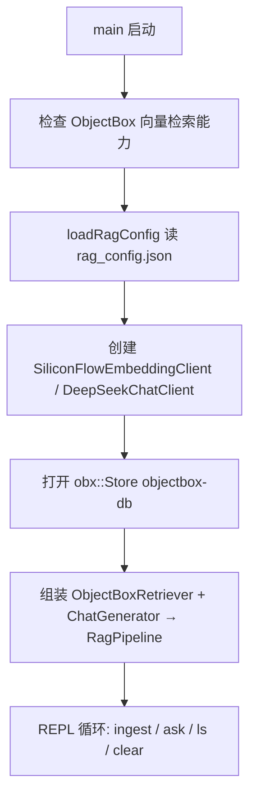

# rag_basic —— v0.1 端到端最小 RAG CLI 分析

> 对应代码：[examples/rag_apps/rag_basic/](../../examples/rag_apps/rag_basic/)。
> 定位：把 `autumndawn_rag` 静态库的所有零件串起来的最小可运行示例，
> 验证 "文本 → 切块 → Embedding → ObjectBox HNSW 检索 → DeepSeek 生成" 的完整 RAG 闭环。

---

## 1. 构建与产物

在仓库根目录执行：

```bash
mkdir build && cd build
cmake -DCMAKE_BUILD_TYPE=Release ..
make -j
```

相关产物：

| 产物 | 说明 |
|---|---|
| `build/libautumndawn_rag.a` | RAG 核心静态库（rag_basic 链接它） |
| `build/examples/rag_apps/rag_basic/rag_basic` | 本文的主角，交互式 CLI |

构建时 [examples/rag_apps/rag_basic/CMakeLists.txt](../../examples/rag_apps/rag_basic/CMakeLists.txt) 还会把以下文件拷到可执行文件旁边，方便直接运行：

- `rag_config.example.json`（配置模板）
- `rag_config.json`（如果源码目录里已存在）
- `corpus_sample.txt`（来自 `data/corpus/` 的中文示例语料）

## 2. 配置

首次运行前准备配置：

```bash
cd build/examples/rag_apps/rag_basic
cp rag_config.example.json rag_config.json   # 然后填入你的 API key
```

`rag_config.json` 结构（见 [rag_config.example.json](../../examples/rag_apps/rag_basic/rag_config.example.json)）：

| 段 | 用途 | v0.1 默认 |
|---|---|---|
| `embedding` | SiliconFlow Embedding API | `BAAI/bge-m3`（1024 维） |
| `chat` | DeepSeek Chat API | `deepseek-v4-pro` |
| `rerank` | 预留给 v0.3 的重排序 | v0.1 未启用，可留空/不校验 |

`loadRagConfig()` 会拒绝 api_key 为空或明显是 placeholder 的配置，启动即失败并给出提示。

## 3. 运行

```bash
cd build/examples/rag_apps/rag_basic
export LD_LIBRARY_PATH=$(pwd)/../../../../third_party/objectbox/lib:$LD_LIBRARY_PATH
./rag_basic                 # 默认读 ./rag_config.json
./rag_basic /path/to/config.json   # 也可以用 argv[1] 指定配置路径
```

注意：

- ObjectBox 是动态库（`third_party/objectbox/lib/libobjectbox.so`），必须在 `LD_LIBRARY_PATH` 里。
- 启动时会检查 `obx_has_feature(OBXFeature_VectorSearch)`，ObjectBox build 不支持向量检索会直接退出。
- 首次运行会在当前目录创建 `objectbox-db/` 作为向量数据库目录，数据持久化，重启后 `ls` 仍在。

### 交互命令

| 命令 | 作用 |
|---|---|
| `ingest <path>` | 读入文本文件 → 切块 → 批量 embedding → 写入 ObjectBox |
| `ask <question> [K]` | 检索 top-K 上下文（默认 5），打印命中片段并调 DeepSeek 生成答案 |
| `ls` | 打印当前库里的文档（chunk）数 |
| `clear` | 清空所有文档 |
| `help` / `?` | 帮助 |
| `exit` / `quit` | 退出 |

示例会话：

```text
> ingest corpus_sample.txt
Embedding 4 chunk(s) from corpus_sample.txt ...
Done. Total docs now: 4

> ask 什么是 HNSW
---- retrieved contexts (top 3) ----
#1  id=1  src=corpus_sample.txt  score=0.1823
    HNSW（Hierarchical Navigable Small World）是一种 ...
...
---- answer ----
HNSW 是一种基于图的近似最近邻搜索算法 ... (#1)

> ls
Stored documents: 4
> exit
```

`ask` 的参数解析有个小细节：如果最后一个 token 是正整数就当作 topK，其余部分整体作为问题（所以问题里可以带空格）。

## 4. 代码分析

[main.cpp](../../examples/rag_apps/rag_basic/main.cpp) 不到 200 行，结构是经典的 "组装零件 → REPL"：



### 4.1 启动阶段（main 前半段）

1. `#define OBX_CPP_FILE`：让 `objectbox.hpp` 的模板实现在本编译单元实例化（ObjectBox C++ 绑定的单 TU 约定）。
2. `loadRagConfig(configPath)`：解析 JSON 配置，失败抛 `ConfigError`，提示用户从 example 拷贝。
3. 创建两个云端客户端（`shared_ptr`，按接口持有）：
   - `SiliconFlowEmbeddingClient`：硬编码 `dim=1024`，与 bge-m3 输出维度及 ObjectBox 里 HNSW 索引维度一致。
   - `DeepSeekChatClient`：模型名来自配置。
4. 打开 ObjectBox：`obx::Options options(rag::createRagModel())` 加载 `Document` 实体模型（生成代码在 `src/obx/`），库目录固定为 `objectbox-db`。
5. 组装管线：
   - `ObjectBoxRetriever(store, embedder)` 实现 `IRetriever`；
   - `ChatGenerator(chatClient)` 实现 `IGenerator`（内置中文 system prompt + `{context}`/`{question}` 模板）；
   - `RagPipeline(retriever, generator)` 就是最直白的 "retrieve → generate" 两段式。
6. `RecursiveCharacterTextSplitter` 用默认参数：chunk ≤ 1200 字节、相邻重叠 120 字节，按 `"\n\n" → "\n" → "。" → ...` 递归切分。

### 4.2 REPL 循环

`std::getline` 逐行读命令，`splitCliInput` 按空白切 token，分发到各命令分支；整个分发包在 try/catch 里，单条命令出错（如文件不存在、网络失败）只打印错误，不会退出 CLI。

### 4.3 ingest 数据流

```text
readFileAll(path)                     // 整个文件读成 string
  → splitter.split(raw)               // 递归字符切块（字节级，对中文按字节数算）
  → retriever->ingest(chunks, path)   // 批量 embedding + 单事务写入 ObjectBox
```

- 空文件/切不出块直接提示并跳过。
- `source` 标签记录文件名，检索结果里的 `src=` 就是它，方便溯源。

### 4.4 ask 数据流

```text
pipeline.ask(question, topK)
  ├─ retriever->retrieve(query, topK)   // query → embedding → HNSW cosine 近邻
  └─ generator->generate(query, ctxs)   // 拼 prompt → DeepSeek → answer
```

- `RagPipeline::ask` 本身只有两行：先检索后生成，把 `contexts` 和 `answer` 一起返回。
- CLI 先把命中的片段逐条打印（序号 / obx id / 来源 / cosine 距离 / 文本），再打印最终答案。
- `ChatGenerator` 的默认模板要求模型"严格根据上下文作答，并在末尾标注引用了哪几个片段编号"，与 CLI 打印的 `#N` 序号对应。

### 4.5 用到的库组件一览

| 组件 | 头文件 | 在 rag_basic 中的角色 |
|---|---|---|
| `loadRagConfig` / `RagConfig` | [rag/config.hpp](../include/rag/config.hpp) | 三段式云端 API 配置加载与校验 |
| `SiliconFlowEmbeddingClient` | [rag/inference/embedding_client.hpp](../include/rag/inference/embedding_client.hpp) | 文本 → 1024 维向量 |
| `DeepSeekChatClient` | [rag/inference/chat_client.hpp](../include/rag/inference/chat_client.hpp) | 调 DeepSeek chat completion |
| `createRagModel` / `ObjectBoxRetriever` | [rag/objectbox_retriever.hpp](../include/rag/objectbox_retriever.hpp) | ObjectBox HNSW 向量存取与检索 |
| `RecursiveCharacterTextSplitter` | [rag/text_splitter.hpp](../include/rag/text_splitter.hpp) | ingest 前的文本切块 |
| `ChatGenerator` | [rag/generator.hpp](../include/rag/generator.hpp) | prompt 组装 + LLM 生成 |
| `RagPipeline` | [rag/pipeline.hpp](../include/rag/pipeline.hpp) | retrieve → generate 编排 |
| `RetrievedChunk` / `IRetriever` | [rag/retriever.hpp](../include/rag/retriever.hpp) | 检索结果与检索器抽象 |

## 5. 已知限制（v0.1）

- splitter 按**字节数**切分，中文一个字 3 字节（UTF-8），1200 字节 ≈ 400 字；切块边界可能切在多字节字符附近，靠重叠区缓解。
- 每次 ingest 都调一次云端批量 embedding，大文件会受 API 限流影响；没有去重，重复 ingest 同一文件会产生重复 chunk。
- 检索只有单 query 向量召回，没有 multi-query / rerank（`rerank` 配置段是预留的）。
- 数据库目录固定为 CWD 下的 `objectbox-db`，换目录运行就是换了一个库。
