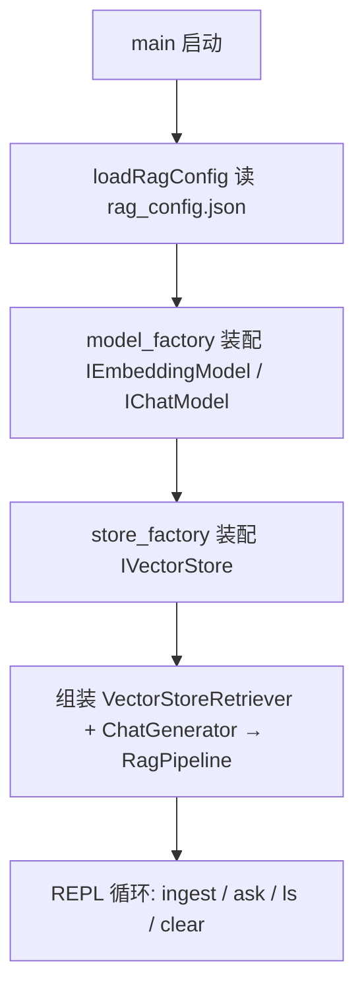

# rag_basic —— v0.1 端到端最小 RAG CLI 分析

> 对应代码：[examples/rag_apps/rag_basic/](../../examples/rag_apps/rag_basic/)。
> 定位：把 `autumndawn_rag` 静态库的所有零件串起来的最小可运行示例，
> 验证 "文本 → 切块 → Embedding → 向量库（ObjectBox HNSW）检索 → DeepSeek 生成" 的完整 RAG 闭环。

---

## 1. 构建与产物

在仓库根目录执行：

```bash
mkdir build && cd build
cmake -DCMAKE_BUILD_TYPE=Release ..
make -j
```

相关产物：

| 产物 | 说明 |
|---|---|
| `build/libautumndawn_rag.a` | RAG 核心静态库（rag_basic 链接它） |
| `build/examples/rag_apps/rag_basic/rag_basic` | 本文的主角，交互式 CLI |

构建时 [examples/rag_apps/rag_basic/CMakeLists.txt](../../examples/rag_apps/rag_basic/CMakeLists.txt) 还会把以下文件拷到可执行文件旁边，方便直接运行：

- `rag_config.example.json`（配置模板）
- `rag_config.json`（如果源码目录里已存在）
- `corpus_sample.txt`（来自 `data/corpus/` 的中文示例语料）

## 2. 配置

首次运行前准备配置：

```bash
cd build/examples/rag_apps/rag_basic
cp rag_config.example.json rag_config.json   # 然后填入你的 API key
```

`rag_config.json` 结构（见 [rag_config.example.json](../../examples/rag_apps/rag_basic/rag_config.example.json)）顶层按功能块包裹，当前包含 `model`（推理后端）与 `storage`（向量存储后端）；后续平级新增 `retrieval` / `splitter` 等：

```jsonc
{
  "model": {
    "embedding": { ... },
    "chat":      { ... },
    "rerank":    { ... }
  },
  "storage": {
    "provider":  "objectbox",
    "directory": "objectbox-db"
  }
}
```

`model` 下三个段：

| 段 | 用途 | provider | 默认模型 |
|---|---|---|---|
| `embedding` | Embedding API | `siliconflow` | `BAAI/bge-m3`（1024 维） |
| `chat` | Chat API | `deepseek` | `deepseek-v4-pro` |
| `rerank` | 重排序（可选，v0.1 未接入 pipeline） | `siliconflow` | `BAAI/bge-reranker-v2-m3` |

三个段结构一致，由 `provider` 字段判别后端：cloud 只接受具名厂商标识 `siliconflow` / `deepseek`
（要求 `base_url`/`api_key`/`model`）；`llama_cpp` / `onnx` 为端侧进程内推理预留（要求 `model_path`）。
`provider` 字段必填、不接受缺省，也不接受 `openai_compatible` 这种协议名。
model_factory 会根据 provider 分派到具体 client，不匹配的组合（如 embedding=`deepseek`、chat=`siliconflow`）会抛 `ConfigError`。

`storage` 段：

| 字段 | 说明 |
|---|---|
| `provider`  | 向量库后端标识；当前仅支持 `objectbox`（未来扩展 `qdrant` / `faiss` / `in_memory` 等） |
| `directory` | 该后端的库目录（ObjectBox 会自动创建） |

`storage` 段可选：**整段缺失时会使用默认值** `{ "provider": "objectbox", "directory": "objectbox-db" }`，
向后兼容旧配置文件。存在时按 `provider` 分派到 store_factory 里对应后端。

`loadRagConfig()` 会拒绝 embedding/chat 段 api_key 为空或明显是 placeholder 的配置，启动即失败并给出提示；
`rerank` 段可选——整段缺失或 api_key 是 placeholder 时静默视为未启用。

## 3. 运行

```bash
cd build/examples/rag_apps/rag_basic
export LD_LIBRARY_PATH=$(pwd)/../../../../third_party/objectbox/lib:$LD_LIBRARY_PATH
./rag_basic                 # 默认读 ./rag_config.json
./rag_basic /path/to/config.json   # 也可以用 argv[1] 指定配置路径
```

注意：

- ObjectBox 是动态库（`third_party/objectbox/lib/libobjectbox.so`），必须在 `LD_LIBRARY_PATH` 里。
- 启动会经 `store_factory` → `ObjectBoxVectorStore` 打开库；后者构造函数内部检查
  `obx_has_feature(OBXFeature_VectorSearch)`，缺失会抛 `storage::StorageError`（提示替换 libobjectbox.so）。
  该检查已从 main.cpp 挪到存储层内部，任何用到 ObjectBox 后端的 App 自动受保护。
- 首次运行会在 `storage.directory`（默认 `./objectbox-db`）创建向量库目录，数据持久化，重启后 `ls` 仍在。

### 交互命令

| 命令 | 作用 |
|---|---|
| `ingest <path>` | 读入文本文件 → 切块 → 批量 embedding → 写入向量库（通过 `VectorStoreRetriever::ingest`） |
| `ask <question> [K]` | 检索 top-K 上下文（默认 5），打印命中片段并调 DeepSeek 生成答案 |
| `ls` | 打印当前库里的文档（chunk）数（`store->count()`） |
| `clear` | 清空所有文档（`store->clearAll()`） |
| `help` / `?` | 帮助 |
| `exit` / `quit` | 退出 |

示例会话：

```text
> ingest corpus_sample.txt
Embedding 4 chunk(s) from corpus_sample.txt ...
Done. Total docs now: 4

> ask 什么是 HNSW
---- retrieved contexts (top 3) ----
#1  id=1  src=corpus_sample.txt  score=0.1823
    HNSW（Hierarchical Navigable Small World）是一种 ...
...
---- answer ----
HNSW 是一种基于图的近似最近邻搜索算法 ... (#1)

> ls
Stored documents: 4
> exit
```

`ask` 的参数解析有个小细节：如果最后一个 token 是正整数就当作 topK，其余部分整体作为问题（所以问题里可以带空格）。

## 4. 代码分析

[main.cpp](../../examples/rag_apps/rag_basic/main.cpp) 不到 200 行，结构是经典的 "组装零件 → REPL"：



### 4.1 启动阶段（main 前半段）

main.cpp **不再** `#define OBX_CPP_FILE`，也**不再** `#include "objectbox.hpp"`——所有 ObjectBox 相关
细节（含唯一的 `OBX_CPP_FILE` 定义、`obx_has_feature` 校验、`obx::Options/Store` 生命周期）都已下沉
到 `src/storage/objectbox/objectbox_store.cpp` 内部。

1. `loadRagConfig(configPath)`：解析 JSON 配置（包含 `model` + `storage` 两段），失败抛 `ConfigError`，
   提示用户从 example 拷贝。
2. 经 `model_factory` 按配置里的 `provider` 装配两个推理模型（`shared_ptr`，按接口持有）：
   - `createEmbeddingModel(cfg.model.embedding, kEmbeddingDim)` → `IEmbeddingModel`；`kEmbeddingDim=1024`
     与 bge-m3 输出维度及 ObjectBox 里 HNSW 索引维度一致，client 首次调用时校验。
   - `createChatModel(cfg.model.chat)` → `IChatModel`。
   factory 内部按 `provider` 真分派：`embedding=siliconflow` → `SiliconFlowEmbeddingClient`；
   `chat=deepseek` → `DeepSeekChatClient`（实现在 `src/inference/cloud/`，头文件不对外暴露）；
   不匹配的组合（如 `embedding=deepseek`、`chat=siliconflow`）会抛 `ConfigError`；`llama_cpp` / `onnx`
   目前也抛错（端侧推理尚未实现）。
3. 经 `store_factory` 按 `storage.provider` 装配向量库：
   - `createVectorStore(cfg.storage, kEmbeddingDim)` → `storage::IVectorStore`；
   - 当前只走 `objectbox` 分支，内部 `new ObjectBoxVectorStore(directory, dim)`：先校验运行库带
     `OBXFeature_VectorSearch`，再打开 `directory` 目录下的 ObjectBox 库（不存在则自动创建）；
   - 上层 main.cpp 全程只见 `shared_ptr<IVectorStore>`，不 include 任何 ObjectBox 头。
4. 组装管线：
   - `VectorStoreRetriever(embModel, store)` 实现 `IRetriever`——把 "文本 → embed → searchByVector" 三步
     串成后端无关的通用检索器（约 30 行）；
   - `ChatGenerator(chatModel)` 实现 `IGenerator`（内置中文 system prompt + `{context}`/`{question}` 模板）；
   - `RagPipeline(retriever, generator)` 就是最直白的 "retrieve → generate" 两段式。
5. `RecursiveCharacterTextSplitter` 用默认参数：chunk ≤ 1200 字节、相邻重叠 120 字节，按 `"\n\n" → "\n" → "。" → ...` 递归切分。

### 4.2 REPL 循环

`std::getline` 逐行读命令，`splitCliInput` 按空白切 token，分发到各命令分支；整个分发包在 try/catch 里，单条命令出错（如文件不存在、网络失败）只打印错误，不会退出 CLI。

### 4.3 ingest 数据流

```text
readFileAll(path)                     // 整个文件读成 string
  → splitter.split(raw)               // 递归字符切块（字节级，对中文按字节数算）
  → retriever->ingest(chunks, path)   // 内部：embedder->embedBatch → 组装 DocumentRecord[] → store->putBatch（单事务）
```

- `VectorStoreRetriever::ingest` 是便利方法（`IRetriever` 契约本身只有 `retrieve`），把
  "embed 一批 → 组装中性 `DocumentRecord[]` → `IVectorStore::putBatch`" 三步串起来；`putBatch` 在
  ObjectBox 后端里落成单个写事务。
- 空文件/切不出块直接提示并跳过。
- `source` 标签记录文件名，检索结果里的 `src=` 就是它，方便溯源。

### 4.4 ask 数据流

```text
pipeline.ask(question, topK)
  ├─ retriever->retrieve(query, topK)   // embedder->embed → store->searchByVector → RetrievedChunk[]
  └─ generator->generate(query, ctxs)   // 拼 prompt → DeepSeek → answer
```

- `VectorStoreRetriever::retrieve` 三行：`embedder_->embed(query)` → `store_->searchByVector(vec, topK)`
  → 把 `IVectorStore::SearchHit` 逐条转成上层期望的 `RetrievedChunk`。装饰器（v0.2 的 multi-query / hyde 等）
  就是围绕这一层 `IRetriever` 契约包一层，不感知具体后端。
- `RagPipeline::ask` 本身只有两行：先检索后生成，把 `contexts` 和 `answer` 一起返回。
- CLI 先把命中的片段逐条打印（序号 / obx id / 来源 / cosine 距离 / 文本），再打印最终答案。
- `ChatGenerator` 的默认模板要求模型"严格根据上下文作答，并在末尾标注引用了哪几个片段编号"，与 CLI 打印的 `#N` 序号对应。

### 4.5 用到的库组件一览

| 组件 | 头文件 | 在 rag_basic 中的角色 |
|---|---|---|
| `loadRagConfig` / `RagConfig` / `StorageBackendConfig` | [rag/config.hpp](../../include/rag/config.hpp) | provider 判别的推理后端 + 存储后端配置加载与校验 |
| `IEmbeddingModel` | [rag/inference/embedding_model.hpp](../../include/rag/inference/embedding_model.hpp) | embedding 抽象：文本 → 1024 维向量 |
| `IChatModel` | [rag/inference/chat_model.hpp](../../include/rag/inference/chat_model.hpp) | chat 抽象：多轮消息 → 回复 |
| `IRerankModel` | [rag/inference/rerank_model.hpp](../../include/rag/inference/rerank_model.hpp) | rerank 抽象（v0.1 未接入 pipeline） |
| `createEmbeddingModel` / `createChatModel` / `createRerankModel` | [rag/model_factory.hpp](../../include/rag/model_factory.hpp) | 按 provider 装配推理模型 |
| `IVectorStore` / `DocumentRecord` / `StorageError` | [rag/storage/vector_store.hpp](../../include/rag/storage/vector_store.hpp) | 后端无关的向量库抽象：put/count/clearAll/searchByVector |
| `createVectorStore` | [rag/store_factory.hpp](../../include/rag/store_factory.hpp) | 按 `storage.provider` 装配 `IVectorStore`（当前 → `ObjectBoxVectorStore`） |
| `VectorStoreRetriever` | [rag/retrieval/vector_store_retriever.hpp](../../include/rag/retrieval/vector_store_retriever.hpp) | `IEmbeddingModel` + `IVectorStore` → `IRetriever` 的通用胶水 |
| `RecursiveCharacterTextSplitter` | [rag/text_splitter.hpp](../../include/rag/text_splitter.hpp) | ingest 前的文本切块 |
| `ChatGenerator` | [rag/generator.hpp](../../include/rag/generator.hpp) | prompt 组装 + LLM 生成 |
| `RagPipeline` | [rag/pipeline.hpp](../../include/rag/pipeline.hpp) | retrieve → generate 编排 |
| `RetrievedChunk` / `IRetriever` | [rag/retriever.hpp](../../include/rag/retriever.hpp) | 检索结果与检索器抽象 |

> 具体实现类的头文件全部收在 `src/` 内部，不暴露到 `include/`，外部只能经工厂创建：
> - 推理：`SiliconFlowEmbeddingClient` / `DeepSeekChatClient` / `SiliconFlowRerankClient`
>   （`src/inference/cloud/`）经 `model_factory` 创建；
> - 存储：`ObjectBoxVectorStore`（`src/storage/objectbox/`，含 `document.fbs` schema、objectbox-generator
>   产物、`OBX_CPP_FILE` 唯一定义）经 `store_factory` 创建。

## 5. 已知限制（v0.1）

- splitter 按**字节数**切分，中文一个字 3 字节（UTF-8），1200 字节 ≈ 400 字；切块边界可能切在多字节字符附近，靠重叠区缓解。
- 每次 ingest 都调一次云端批量 embedding，大文件会受 API 限流影响；没有去重，重复 ingest 同一文件会产生重复 chunk。
- 检索只有单 query 向量召回，没有 multi-query / rerank。rerank 零件已就绪（`IRerankModel` + `SiliconFlowRerankClient` + 工厂），v0.3 将以 `RerankingRetriever` 装饰器接入。
- 存储后端目前只有 ObjectBox 一个实现。抽象层（`IVectorStore` + `store_factory`）已就绪，新增 Qdrant/FAISS/in_memory
  等按固定三步（`*StorageConfig` + `xxx_store.{hpp,cpp}` + factory 分派）即可，`retrieval/pipeline/App` 零改动。
- 库目录来自 `storage.directory` 配置项，默认 `./objectbox-db`；换目录运行就是换了一个库。
