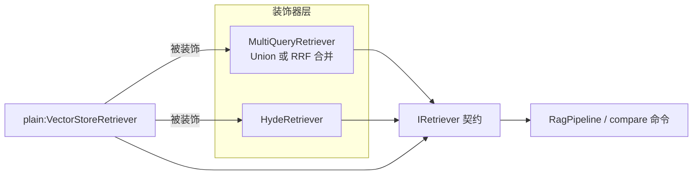

# rag_query_translate —— v0.2 Query Translation 策略对比 CLI 分析

> 对应代码:[examples/rag_apps/rag_query_translate/](../../examples/rag_apps/rag_query_translate/)。
> 定位:在 v0.1 基线(plain 向量检索)之上,演示三种 **Query Translation** 检索策略——
> Multi-Query(课程小节 5)、RAG-Fusion / RRF(小节 6)、HyDE(小节 9),
> 并用 `compare` 命令把四种策略对同一问题的召回差异直接打印在终端。
>
> 前置阅读:[rag_basic_code_analysis.md](rag_basic_code_analysis.md)(v0.1 的装配与数据流本文不再重复)。

---

## 1. v0.2 新增了什么

| 新增 | 位置 | 一句话 |
|---|---|---|
| `fusion::rrf` | [rag/fusion.hpp](../../include/rag/fusion.hpp) / [src/fusion.cpp](../../src/fusion.cpp) | Reciprocal Rank Fusion:把多份召回排名融合成一份,只看名次不看分数量纲 |
| `MultiQueryRetriever` | [rag/retrieval/multi_query_retriever.hpp](../../include/rag/retrieval/multi_query_retriever.hpp) / [src/retrieval/multi_query_retriever.cpp](../../src/retrieval/multi_query_retriever.cpp) | 装饰器:LLM 改写 N 条查询 → 并联检索 → Union/RRF 合并 |
| `HydeRetriever` | [rag/retrieval/hyde_retriever.hpp](../../include/rag/retrieval/hyde_retriever.hpp) / [src/retrieval/hyde_retriever.cpp](../../src/retrieval/hyde_retriever.cpp) | 装饰器:LLM 先"假答"出一段文档,再拿它去做向量检索 |
| `rag_query_translate` | [examples/rag_apps/rag_query_translate/main.cpp](../../examples/rag_apps/rag_query_translate/main.cpp) | 本文主角,四策略切换 + 同题对比 CLI |
| 对比语料 | [data/corpus/corpus_query_translate.txt](../../data/corpus/corpus_query_translate.txt) | 为体现策略差异专门设计的 15-chunk 中文语料(见 §6) |

核心思想只有一个:**三种策略全部实现为 `IRetriever` 装饰器**——包住任意底层
检索器,对上层仍然表现为一个 `IRetriever`。`RagPipeline`、`ChatGenerator`、存储层
零改动;策略之间也可以再互相嵌套(v0.3 的 `RerankingRetriever` 同理)。



## 2. 构建与运行

构建同 v0.1(仓库根 `cmake .. && make -j`),新增产物
`build/examples/rag_apps/rag_query_translate/rag_query_translate`。

配置复用 v0.1 的 `rag_config.json` 结构。CMake 拷贝顺序有个便利设计:
**优先用本目录的 `rag_config.json`,没有则自动借用 `rag_basic/` 已填好 key 的那份**
(见 [CMakeLists.txt](../../examples/rag_apps/rag_query_translate/CMakeLists.txt)),
所以只要 rag_basic 配好过,这里零配置直接跑。

```bash
cd build/examples/rag_apps/rag_query_translate
export LD_LIBRARY_PATH=$(pwd)/../../../../third_party/objectbox/lib:$LD_LIBRARY_PATH
./rag_query_translate                        # 默认策略 plain,读 ./rag_config.json
./rag_query_translate --strategy=rrf         # 启动时指定策略
./rag_query_translate my_config.json --strategy=hyde   # 两者可并存
```

### 交互命令(相对 v0.1 的增量)

| 命令 | 作用 |
|---|---|
| `strategy [name]` | 查看 / 切换当前策略(`plain` / `multi_query` / `rrf` / `hyde`) |
| `ask <question> [K]` | 用**当前策略**检索 top-K,再走 `RagPipeline` 生成答案 |
| `compare <question> [K]` | **四种策略同题各跑一遍检索(不生成)**,打印召回差异 |
| `ingest` / `ls` / `clear` / `help` / `exit` | 同 v0.1 |

`compare` 输出里,`*` 标记的条目表示 **plain 未召回、该策略新召回**的 chunk;
multi_query / rrf 会附打 LLM 实际改写出的查询列表,hyde 附打假设性文档预览。

# 3. 三种策略的原理与数据流

> 三种策略解决的是同一个根本问题：**用户的提问方式 ≠ 文档的写作方式**，
> 导致直接拿问题去做向量检索时，相关文档可能排不进 top-K。
> 它们的区别在于"用什么手段弥补这个鸿沟"。

### 3.1 Multi-Query（多查询 + Union 合并）

#### 要解决的问题

用户说"电脑卡顿"，文档写"系统响应延迟过高"——两者语义相同但用词不同，
在向量空间里距离可能很远。一个 query 只有一个向量位置，碰巧落不进相关文档
的邻域就漏掉了。

#### 核心思路

既然一个问法不够，就让 LLM 把同一个问题**换几种说法**重新表述，
每种说法各自去检索，最后把所有结果合在一起。相当于在向量空间里
多放几个"探针"，增大命中相关文档的概率。

#### 执行步骤（以 N=3, topK=5 为例）

**① 改写**：把用户问题交给 LLM，要求它生成 3 条不同角度的改写。
例如原问题"怎么让检索变快"可能被改写为：
- "向量数据库查询性能优化方法"
- "减少 embedding 检索延迟的技术"
- "ANN 索引加速方案"

加上原始问题，一共 **4 条 query**。

**② 并联检索**：4 条 query **各自独立**去向量库检索 top-5，
互不干扰，得到 4 份排名列表（每份 5 条）：

| 排名 | query₁（原始） | query₂（改写A） | query₃（改写B） | query₄（改写C） |
|---|---|---|---|---|
| 第1名 | 文档A | 文档C | 文档A | 文档F |
| 第2名 | 文档B | 文档A | 文档D | 文档A |
| 第3名 | 文档C | 文档E | 文档B | 文档G |
| 第4名 | 文档D | 文档B | 文档F | 文档B |
| 第5名 | 文档E | 文档F | 文档G | 文档H |

注意不同 query 召回的文档有重叠（文档A 出现了 3 次），也有各自独有的。

**③ Union 合并（轮转交错）**：按名次一轮一轮地取，遇到重复（按 id）跳过：

- **第 1 轮**：取每路的第 1 名 → A、C、A（重复跳过）、F → 收入 `A, C, F`
- **第 2 轮**：取每路的第 2 名 → B、A（重复）、D、A（重复） → 收入 `B, D`
- **第 3 轮**：取每路的第 3 名 → C（重复）、E、B（重复）、G → 收入 `E, G`
- 第 4、5 轮同理……

合并结果（按收入顺序）：`A, C, F, B, D, E, G, ...` → **截断到 topK=5**：`A, C, F, B, D`

#### 关键设计

- **为什么不直接比较各路的分数？** query₁ 给文档A 打了 0.92，query₂ 给
  文档C 打了 0.95——能说 C 比 A 更相关吗？不能。两个 query 向量不同，
  各自的 cosine 距离是在不同参照系下算出来的，绝对数值没有可比性。
  所以 Union 合并**完全不看分数**，只利用一个信息：每路内部已排好序。
  轮转交错的效果是——每路的"最相关"都公平地排在前面，某路独有的文档
  也不会因为"别的路分数更高"而被挤掉。
- **容错降级**：LLM 改写失败（网络超时、限流等）时不抛异常，
  自动退化为只用原始 query 检索，等价于 plain 策略。

### 3.2 RAG-Fusion（多查询 + RRF 合并）

#### 与 Multi-Query 的关系

RAG-Fusion 和 Multi-Query **共用同一个类** `MultiQueryRetriever`，
前两步（LLM 改写 → 并联检索）完全相同，唯一的区别在第三步的合并算法：
把 Union 换成 **RRF（Reciprocal Rank Fusion）**。

#### RRF 的打分公式

$$\text{score}(d) = \sum_{i} \frac{1}{k + \text{rank}_i(d)}, \quad k = 60$$

其中 \(\text{rank}_i(d)\) 是文档 \(d\) 在第 \(i\) 路排名中的名次（从 1 开始），
如果某路没有召回该文档则不参与求和。

#### 直觉理解

- 一篇文档如果**被多条改写都召回、且每次都排在前面**，它的 RRF 得分就高。
  这意味着"多个不同角度的查询都认为它相关"——比单路给个高分更可信。
- 反过来，只被一条改写偶然召回的文档，得分自然低，不容易混进最终 top-K。

#### 计算示例（沿用 3.1 的 4 路排名表，k=60）

还是那 4 份列表：

| 排名 | query₁（原始） | query₂（改写A） | query₃（改写B） | query₄（改写C） |
|---|---|---|---|---|
| 第1名 | 文档A | 文档C | 文档A | 文档F |
| 第2名 | 文档B | 文档A | 文档D | 文档A |
| 第3名 | 文档C | 文档E | 文档B | 文档G |
| 第4名 | 文档D | 文档B | 文档F | 文档B |
| 第5名 | 文档E | 文档F | 文档G | 文档H |

逐篇计算 RRF 得分（每出现一次就加一项 \(\frac{1}{60+\text{rank}}\)）：

| 文档 | 出现位置 | RRF 得分计算 | 合计 |
|---|---|---|---|
| 文档A | q₁第1、q₂第2、q₃第1、q₄第2 | 1/61 + 1/62 + 1/61 + 1/62 | **0.06504** |
| 文档B | q₁第2、q₂第4、q₃第3、q₄第4 | 1/62 + 1/64 + 1/63 + 1/64 | **0.06371** |
| 文档C | q₁第3、q₂第1 | 1/63 + 1/61 | 0.03226 |
| 文档F | q₂第5、q₃第4、q₄第1 | 1/65 + 1/64 + 1/61 | 0.04745 |
| 文档D | q₁第4、q₃第2 | 1/64 + 1/62 | 0.03175 |
| 文档E | q₁第5、q₂第3 | 1/65 + 1/63 | 0.03125 |
| 文档G | q₃第5、q₄第3 | 1/65 + 1/63 | 0.03125 |
| 文档H | q₄第5 | 1/65 | 0.01538 |

按得分降序排列 → 最终 top-5：`A, B, F, C, D`

**对比 3.1 Union 的结果**（`A, C, F, B, D`）：

- 文档B 在 Union 里排第 4，在 RRF 里升到第 2——因为它被 **4 路全部召回**，
  虽然每路名次不是第一，但 RRF 奖励"稳定出现"；
- 文档C 在 Union 里排第 2（因为它是 query₂ 的第 1 名，第 1 轮就被收入），
  但 RRF 里降到第 4——它只被 2 路召回，"共识"不够。

这就是 RRF 与 Union 的核心差异：**Union 只看"每路第几名"（位置优先），
RRF 同时看"被几路召回"（共识优先）**。

#### 为什么 k=60？

\(k\) 的作用是**压平榜首差距**。对比：
- 若 k=0：第 1 名得 1/1=1.0，第 2 名得 1/2=0.5，差距巨大→某一路的第 1 名
  几乎独裁整个结果。
- 若 k=60：第 1 名得 1/61≈0.0164，第 2 名得 1/62≈0.0161，差距极小→
  单路名次的影响被削弱，"被多路同时召回"才是决定性因素。

60 是原始论文和 LangChain 的共同默认值。

#### 实现要点

- 以 `RetrievedChunk::id` 去重：首次出现记录文本内容，之后只累加得分。
- `std::stable_sort` 降序排列；得分相同时保持先见顺序（稳定性）。
- 输出的 `score` 字段含义变为"RRF 得分，越大越相关"，与 plain 的
  cosine 距离（越小越相关）语义不同。这没问题——`IRetriever` 契约只保证
  "返回列表已按相关性从高到低排列"，不承诺分数的绝对含义。

### 3.3 HyDE（Hypothetical Document Embeddings，假设性文档嵌入）

#### 要解决的问题

问句和文档在 embedding 空间里**天然不对称**：
- 问句短、是疑问语气："如何让检索变快？"
- 文档长、是陈述语气："通过 HNSW 索引参数调优和向量量化可以将检索延迟降低……"

两者在向量空间里本来就不在一个区域，直接匹配效果差。

#### 核心思路

不拿"问题"去检索，而是先让 LLM **假装回答这个问题**，生成一段"假设性答案"。
这段假答案和真实文档一样是陈述体、包含相关术语——再去检索时，
就变成了"文档 vs 文档"的对称匹配，向量距离更近。

#### 对比示例：为什么假文档的向量更接近真实文档

假设用户问："怎么让检索变快？"，而库里的真实文档是：

> 「通过调整 HNSW 索引的 efConstruction 和 M 参数，可以在召回率与检索速度之间
> 取得平衡；结合 PQ（乘积量化）对向量进行压缩，能进一步将单次检索延迟从
> 50ms 降至 10ms 以内……」

现在比较两种"检索 query"与这篇真实文档的匹配情况：

| | 原始问句 | HyDE 假设性文档 |
|---|---|---|
| **文本** | "怎么让检索变快？" | "可以通过调整 HNSW 索引参数（如 efConstruction、M）来加速向量检索，同时使用乘积量化（PQ）压缩向量维度以降低计算开销，从而将检索延迟显著降低……" |
| **语气** | 疑问句，7 个字 | 陈述句，~60 字 |
| **术语覆盖** | 无（"检索""快"是日常词） | HNSW、efConstruction、M、PQ、向量压缩、检索延迟 |
| **与真实文档的向量距离** | 远（短问句 vs 长技术陈述，分布区域不同） | 近（同为陈述体、共享大量术语和句式结构） |

关键观察：

- 原始问句太短、太口语化，embedding 模型把它编码到一个"提问"的区域，
  而真实文档在"技术说明"的区域——两者天然距离远。
- 假设性文档虽然**细节可能不准确**（比如参数值可能是编的），
  但它的**文体、术语、句式结构**和真实文档高度对齐，
  embedding 模型主要捕捉的正是这些语义特征，所以向量距离近。
- 一句话：HyDE 利用的是"形式对齐"而非"事实正确"。

#### 执行步骤

1. **生成假设性文档**：把用户问题交给 LLM，prompt 要求它"即使不确定也直接
   写出最可能的答案内容，不要拒答、不要声明自己在假设"。
2. **用假文档替代原问题去检索**：把这段假设性文本当作 query，
   走正常的 embed → 向量检索流程，取 top-K。

整个流程只有**一次 LLM 调用 + 一次 embedding + 一次检索**，开销比
Multi-Query 小得多。

#### 关键设计

- **不要求假答案内容正确**：HyDE 利用的是假答案在"文体、术语、句式"
  上与真实文档的对齐，而非事实准确性。即使细节有误，embedding 模型的
  语义压缩能力会弱化这些错误的影响。
- **prompt 中"不要拒答"是关键**：如果 LLM 回复"我不确定，但可能是……"，
  这段文本的向量就会偏向"不确定/元描述"方向，失去与目标文档的文体对齐。
- **容错降级**：LLM 调用失败时自动回退到原始 query，等价于 plain。

### 3.4 三种策略的成本与取舍

| 策略 | 额外 LLM 调用 | 额外 embedding 调用 | 额外向量检索 | 适用场景 |
|---|---|---|---|---|
| plain | 0 | 1（query 本身） | 1 | 基线；问题与文档用词接近时足够 |
| multi_query | 1（生成改写） | N（每条改写各一次） | N | 提升**召回率**；同义词/多表述场景 |
| rrf | 1（生成改写） | N（每条改写各一次） | N | 提升**召回精度**；多路交叉验证过滤噪声 |
| hyde | 1（生成假答） | 1（假文档） | 1 | 问答文体差异大；需要**抗表面词干扰** |

> 注意：multi_query 和 rrf 在提升召回的同时也可能**引入噪声**（把表面相关
> 的干扰项拉进 top-K），这正是 v0.3 引入 Re-ranking 的动机。

## 4. main.cpp 组装分析

结构仍是 v0.1 的"组装零件 → REPL",差异在检索器的装配:

```cpp
auto plainRetriever = std::make_shared<rag::VectorStoreRetriever>(embModel, store);

auto multiQueryRetriever = std::make_shared<rag::MultiQueryRetriever>(plainRetriever, chatModel);

rag::MultiQueryRetriever::Options rrfOpts;
rrfOpts.merge = rag::MultiQueryRetriever::MergeStrategy::Rrf;
auto rrfRetriever = std::make_shared<rag::MultiQueryRetriever>(plainRetriever, chatModel, rrfOpts);

auto hydeRetriever = std::make_shared<rag::HydeRetriever>(plainRetriever, chatModel);
```

要点:

- **四个检索器共享同一个 `plainRetriever` 底座**(进而共享同一 embedding 模型、
  同一 ObjectBox store),策略间的差异只来自"query 怎么变换、结果怎么合并",
  对比才有控制变量的意义;
- `ingest` 永远走 `plainRetriever->ingest()`——写入路径与检索策略无关;
- 策略名 → 检索器用一张 `std::map<std::string, std::shared_ptr<IRetriever>>` 收拢,
  `ask` 时现场 `RagPipeline(retrievers.at(strategy), generator)` 组一条管线,
  体现 pipeline 是廉价的组合器,不持有状态;
- `compare` 分支只调 `retrieve` 不调 generator:先跑 plain 记下命中 id 集合,
  其余策略打印时对不在集合里的条目标 `*`;
- 中间产物观测:`MultiQueryRetriever::lastQueries()` /
  `HydeRetriever::lastHypotheticalDoc()` 暴露最近一次检索的改写查询 / 假设文档,
  demo 持有具体类型指针来调用(`IRetriever` 契约保持最小)。

## 5. 库组件增量一览

| 组件 | 头文件 | 角色 |
|---|---|---|
| `fusion::rrf` | [rag/fusion.hpp](../../include/rag/fusion.hpp) | 多路排名融合(纯函数,~40 行,无任何 I/O 依赖) |
| `MultiQueryRetriever` | [rag/retrieval/multi_query_retriever.hpp](../../include/rag/retrieval/multi_query_retriever.hpp) | Multi-Query + RAG-Fusion 装饰器(`Options::merge` 二选一) |
| `HydeRetriever` | [rag/retrieval/hyde_retriever.hpp](../../include/rag/retrieval/hyde_retriever.hpp) | HyDE 装饰器 |

两个装饰器只依赖 `IRetriever` / `IChatModel` 抽象 + `prompt::format`,
不 include 任何 inference/cloud 或 storage 后端头文件——这是 v0.1 立下的
分层纪律在 v0.2 的第一次兑现:新增两个检索策略,`src/inference/`、`src/storage/`
一行未动。

## 6. 对比语料的设计(corpus_query_translate.txt)

旧语料(`corpus_sample.txt`)只切出 2 个 chunk,topK=5 时任何策略都全量召回,
测不出差异。新语料 15 个 chunk(每段 300~400 汉字,保证切分器一段一块),
按"给谁设计陷阱/机会"分三类:

| 设计元素 | 针对策略 | 语料中的落点 |
|---|---|---|
| **同义改写簇**:同一主题用不同术语表述 | multi_query | 召回率/查全率、多路召回/混合检索、查询扩展/词汇不匹配 |
| **多面向答案**:一个问题的答案分散在多块 | rrf | "检索提速"分散在 HNSW 参数、向量量化、缓存/批量三段 |
| **表面词干扰项**:与问题共享字面词但语义无关 | hyde | 图书馆检索大厅规定、Elasticsearch 运维、IT 工单系统;以及"只描述问题不给方案"的知识截止日期段 |

实测(问"模型怎么才能回答训练之后才发生的事情"):

- **hyde** 召回了 plain 漏掉的"RAG 免重训更新知识"段(正是答案),并且把
  "工单系统"干扰项挡在榜外——假答文档与"方案型"段落的文体对齐生效;
- **multi_query / rrf** 反而把"工单系统"干扰项拉进了 top-5:查询扩展在提升
  查全率的同时也**放大了噪声**。这个现象本身就是教学点——它正是 v0.3 要引入
  Re-ranking(recall → precision)的动机。

推荐的自测问题:

```text
compare 如何让检索变快              # 看 rrf 融合多面向、hyde 召回缓存段
compare 怎么减少检索漏掉相关文档的情况   # 看 multi_query 覆盖同义簇
compare 模型怎么才能回答训练之后才发生的事情  # 看 hyde 抗干扰、multi_query 引噪
```

## 7. 已知限制(v0.2)

- **多路检索是串行的**:N 条改写逐条 embed + 检索,延迟随 N 线性增长;并发化
  受限于 `I*Model` "调用方串行访问"的线程安全契约,留待后续版本。
- **改写质量不受控**:LLM 输出按行解析 + 前缀清洗(`cleanLine`),但无 schema 约束;
  改写偏题时会引入无关召回,且每次 `retrieve` 都重新调 LLM,同一问题重复提问
  没有改写缓存。
- **Union 合并的排序较弱**:名次轮转只保证公平交错,不代表真实相关性排序;
  RRF 是更有依据的选择,Union 主要用于对照教学。
- **查询扩展放大噪声**(见 §6 实测):没有 rerank 兜底之前,multi_query/rrf 的
  top-K 里可能混入表面相关的干扰项——v0.3 的 `RerankingRetriever` 直接解决。
- `compare` 的 `*` 标记只对比"是否被 plain 召回",没有 ground-truth 标注,
  召回质量仍需肉眼判断;系统化的策略评测(QA 集 + recall 指标)是 v1.0
  `rag_bench` 的范围。
