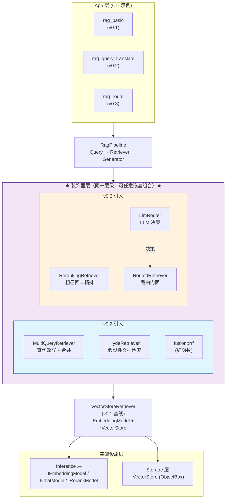
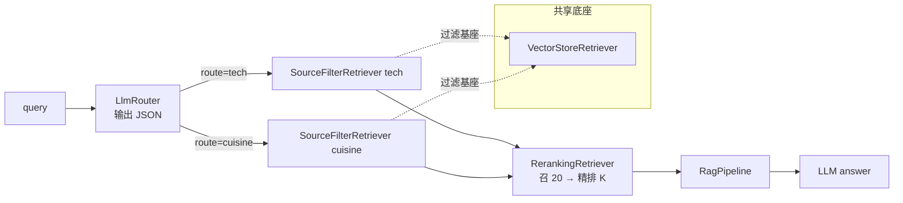

# rag_route —— v0.3 Logical Routing + Re-ranking CLI 分析

> 对应代码:[examples/rag_apps/rag_route/](../../examples/rag_apps/rag_route/)。
> 定位:在 v0.2 的 query translation 装饰器体系之上,把 **Router**(课程小节 10a Logical Routing)
> 与 **Re-ranker**(课程小节 15)接入检索链,组装出计划中的 v0.3 标杆链路:
> `Router → Retriever → Reranker → Generator`——达到"生产级最小可用"标准。
>
> 前置阅读:[rag_basic_code_analysis.md](rag_basic_code_analysis.md)(v0.1 装配)、
> [rag_query_translate_code_analysis.md](rag_query_translate_code_analysis.md)(v0.2 装饰器基线)。

---

## 1. v0.2 → v0.3：演进关系与模块层次

### 1.1 装饰器体系：同一个工具箱

v0.2 和 v0.3 的所有组件都实现同一个接口 `IRetriever`：

```cpp
// v0.2 引入的装饰器
class MultiQueryRetriever : public IRetriever { ... }  // 查询改写 + 多路合并
class HydeRetriever : public IRetriever { ... }        // 假设性文档检索

// v0.3 引入的装饰器
class RerankingRetriever : public IRetriever { ... }   // 粗召回 → 精排
class RoutedRetriever : public IRetriever { ... }      // 路由门面
```

这意味着它们可以**任意嵌套组合**。例如：

```cpp
// 理论上的组合：先路由到 tech 域，再用 MultiQuery 改写，最后精排
auto techMultiQuery = std::make_shared<MultiQueryRetriever>(
    techFilterRetriever,  // v0.3 的域过滤
    chatModel
);
auto rerankedTech = std::make_shared<RerankingRetriever>(
    techMultiQuery,       // v0.2 的查询改写
    rerankModel
);
```

### 1.2 模块层次对比图



**组合示例**（装饰器可以任意嵌套）：

```cpp
// v0.3 + v0.2 组合：先改写查询，再精排
RerankingRetriever( MultiQueryRetriever( VectorStoreRetriever ) )

// v0.3 内部组合：路由 + 精排
RerankingRetriever( RoutedRetriever( LlmRouter → {tech: X, cuisine: Y} ) )

// 未来可能：路由到不同策略
RoutedRetriever( LlmRouter → {
    tech: RerankingRetriever(MultiQueryRetriever(X)),  // tech 域用复杂策略
    cuisine: X                                          // cuisine 域用简单策略
})
```

### 1.3 关键理解：三个要点

**① 装饰器层是"平级"的，不是"上下级"**

```
错误理解：  v0.3 装饰器 在 v0.2 装饰器 之上
正确理解：  v0.2 和 v0.3 的装饰器 在同一个层级，都可以：
            ├── 直接装饰 VectorStoreRetriever
            └── 互相嵌套（谁包谁都可以）
```

**② 每个版本只是"往工具箱里加工具"**

```
工具箱 (IRetriever 装饰器集合):
├── v0.1 提供底座: VectorStoreRetriever
├── v0.2 加入:   MultiQueryRetriever, HydeRetriever, fusion::rrf
├── v0.3 加入:   RerankingRetriever, RoutedRetriever, LlmRouter
└── v0.4 将加入: StepBackRetriever, DecompositionPipeline, ...
```

**③ 示例 App 只是"挑选工具组合演示"**

```
rag_query_translate (v0.2 示例) 挑选的组合:
    plain / MultiQuery(plain) / MultiQuery+RRF(plain) / Hyde(plain)

rag_route (v0.3 示例) 挑选的组合:
    plain / Routed(plain×2) / Rerank(plain) / Rerank(Routed(plain×2))

理论上还可以组合 (示例没演示):
    Rerank(MultiQuery(plain))        ← v0.3 + v0.2
    Routed(LlmRouter → MultiQuery)   ← v0.3 + v0.2
```

### 1.4 查询流程的本质差异

**v0.2 查询流程（线性变换）**

```
Query → [装饰器变换 query] → 向量检索 → 返回结果
         ↓
    MultiQuery: 一个 query 变多个 query，各自检索再合并
    Hyde:       query 变假文档，用假文档检索
```

特点：query 被**变换**了，但检索目标始终是同一个库。

**v0.3 查询流程（分支 + 后处理）**

```
Query → [Router 决策走哪条路] → [子检索器检索] → [Rerank 精排] → 返回结果
         ↓
    LlmRouter 输出 {"route":"tech"}
         ↓
    RoutedRetriever 查表找到 tech 对应的 SourceFilterRetriever
         ↓
    SourceFilterRetriever 在 tech 域内检索
         ↓
    RerankingRetriever 对结果精排
```

特点：
1. **Router 不改写 query**，只做"选哪个路"的决策
2. **检索目标变了**——从"全库"变成"某个域"
3. **Rerank 是后处理**——检索完再精排，不是 query 变换

### 1.6 功能对比总结

| 维度 | v0.2 | v0.3 |
|------|------|------|
| **解决问题** | 用户问法 ≠ 文档写法 | 多域知识库 + 精度提升 |
| **知识库** | 单一 | 多域（tech / cuisine） |
| **决策方式** | 无决策，直接变换 query | LLM 做逻辑分支选择 |
| **新增组件** | 2 个装饰器 + 1 个融合函数 | 1 个路由器 + 2 个装饰器 |
| **LLM 调用次数** | 1 次（改写/假答） | 1 次（路由）+ 1 次（rerank） |
| **核心思想** | 提高召回率（recall） | 先选路（routing）→ 再精排（precision） |

---

## 2. v0.3 新增组件一览

| 组件 | 位置 | 角色 |
|---|---|---|
| `RerankingRetriever` | [rag/retrieval/reranking_retriever.hpp](../../include/rag/retrieval/reranking_retriever.hpp) / [src/retrieval/reranking_retriever.cpp](../../src/retrieval/reranking_retriever.cpp) | 两阶段检索装饰器:底层粗召回 N 条 → `IRerankModel` 精排 → 取 topK |
| `IRouter` / `IRouter::Decision` | [rag/router.hpp](../../include/rag/router.hpp) / [src/router.cpp](../../src/router.cpp) | 路由抽象;`Decision{route, reason}` |
| `RouteChoice` | 同上 | 路由目标声明(name + description) |
| `LlmRouter` | 同上 | 让 LLM 输出 JSON `{"route","reason"}` 决策,含 4 道容错 |
| `RoutedRetriever` | 同上 | 决策 → 子检索器的门面,呈现为 `IRetriever` |
| `rag_route` | [examples/rag_apps/rag_route/main.cpp](../../examples/rag_apps/rag_route/main.cpp) | 四策略切换 + 同题对比 CLI |
| 多域语料 | [data/corpus/corpus_route_tech.txt](../../data/corpus/corpus_route_tech.txt) / [corpus_route_cuisine.txt](../../data/corpus/corpus_route_cuisine.txt) | tech + cuisine 两个语义相距很远的域,便于观察选路正确性 |

**分层纪律**:三个新类只依赖 `IRetriever` / `IChatModel` / `IRerankModel` +
`prompt::format` + `nlohmann::json`,不 include 任何 `inference/cloud/`、
`storage/` 后端头——延续了 v0.1 立下的规则:新加装饰器/路由器,
`src/inference/` 与 `src/storage/` 一行未动。

核心思路仍是 **"装饰器 + 门面"**:两项新能力全部实现为 `IRetriever` 装饰器,可以任意嵌套。
本示例把它们组装成 `RerankingRetriever(RoutedRetriever(LlmRouter → {…}))`,再交给
既有的 `RagPipeline`——`RagPipeline`、`ChatGenerator`、存储层、旧装饰器全部零改动。



---

## 3. 快速体验

### 3.1 构建与配置

```bash
# 构建（仓库根目录）
cmake .. && make -j

# 配置
cd build/examples/rag_apps/rag_route
cp rag_config.example.json rag_config.json   # 填入 SiliconFlow / DeepSeek 三段 api_key

# 启动
export LD_LIBRARY_PATH=$(pwd)/../../../../third_party/objectbox/lib:$LD_LIBRARY_PATH
./rag_route
```

> **注意**:`rag_route` 强制要求 `model.rerank` 段(SiliconFlow `BAAI/bge-reranker-v2-m3`)。

### 3.2 推荐体验顺序

```text
# 1. 导入双域语料
ingest ../../../../data/corpus/corpus_route_tech.txt tech
ingest ../../../../data/corpus/corpus_route_cuisine.txt cuisine

# 2. 测试路由决策
route 怎么让搜索又快又准
route 汤怎么勾芡才亮而不厚

# 3. 四策略对比（核心体验）
compare 芡汁怎么勾才好看 5
compare 什么是 RAG 检索增强生成 5

# 4. 单策略问答
strategy full
ask HNSW 和 rerank 各解决了什么问题 3
```

### 3.3 命令与策略

| 命令 | 作用 |
|---|---|
| `ingest <path> <source>` | 读入文件,以 `<source>` 作为域标签写入(`tech` 或 `cuisine`) |
| `route <question>` | 只跑一次 LLM 路由,打印 `{route, reason}` |
| `ask <question> [K]` | 用当前策略检索 topK 并生成答案 |
| `compare <question> [K]` | 四种策略同题对比检索差异 |
| `strategy [name]` | 查看 / 切换策略 |

| 策略 | 组合方式 |
|---|---|
| `plain` | 全库向量检索(退化到 v0.1) |
| `route` | LlmRouter 分派到某个 `SourceFilterRetriever` |
| `rerank` | 全库粗召回 → rerank 精排 |
| `full` | Router → 子检索器 → rerank(**v0.3 主打链路**) |

`compare` 输出中,`*` 标记表示"plain 未召回、该策略新召回"的 chunk。

---

## 4. 两项新能力的原理与数据流

### 4.1 Re-ranking(课程小节 15)

#### 4.1.1 要解决的问题

v0.2 三种 query translation 策略都在**提高召回**(让相关文档更可能进入 candidate 集),
但也把表面相关的**噪声干扰项**一起拉进了 top-K:向量近邻检索本质是
bi-encoder("query 单独编码 + doc 单独编码 + 打余弦"),
只能捕捉粗粒度语义相似,分不清"字面相似但答非所问"和"真正回答问题"这两种情况。

体现在实测(见 v0.2 §6 语料):"模型怎么才能回答训练之后才发生的事情"这个问题下,
multi_query / rrf 会把"IT 工单系统"干扰项拉进 top-5——因为改写查询扩大了词表覆盖,
连带击中了表面词相似但语义无关的文档。

#### 4.1.2 核心思路:两阶段检索(粗召回 + 精排)

生产 RAG 里最经典的组合:

1. **Recall 阶段**——bi-encoder 向量检索(便宜、快、粗):
   底层 `IRetriever` 召回一批**候选** (candidateTopN,~20 条),
   目标是"相关文档尽量都进候选集",召回率优先,精度不管。
2. **Precision 阶段**——cross-encoder rerank(贵、慢、准):
   `IRerankModel` 把 `(query, doc)` **一起**送进 transformer,
   模型能建模"query 里的每个 token 与 doc 里每个 token 的交互",
   打出更真实的相关性分数,再取 topK。

cross-encoder 慢在"每对 (query, doc) 都要跑一次前向"——查 1 万篇要 1 万次,
所以只能对 recall 阶段留下的候选跑,规模上生产可用。

#### 4.1.3 算法

```text
retrieve(query, topK) =
    candidates = base.retrieve(query, max(candidateTopN, topK))    # 1. 粗召回
    if candidates.size <= topK: return candidates                  # 2. 短路
    scores = rerankModel.rerank(query, [c.text for c in cands], topK)
    return reorder(candidates by scores)[:topK]                    # 3. 精排 + 截断
```

见 [src/retrieval/reranking_retriever.cpp](../../src/retrieval/reranking_retriever.cpp)。

#### 4.1.4 关键设计

- **candidateTopN 至少要盖住 topK**:实现里用 `std::max(candidateTopN, topK)` 兜底;
  若候选条数 ≤ topK,直接返回不再跑 rerank,省一次 API 调用。默认 `candidateTopN=20`,
  经验值——topK 常见 3~5,20 条候选够 rerank 挑出好的、开销也不至于炸。
- **score 语义改写**:装饰器把 `RetrievedChunk::score` **覆盖为 rerank 分数**
  (0~1,越大越相关);上游的 cosine 距离(越小越相关)信息丢失,但符合
  `IRetriever` 契约("返回顺序 = 相关性从高到低"),分数绝对值本就不承诺可比。
- **rerank 失败降级**:抛异常时打印 warning 并回退成第一阶段的前 topK,不影响
  整个 pipeline 出结果。
- **只依赖抽象**:装饰器只 include `IRetriever` / `IRerankModel`,不感知底层是
  向量库、multi-query 装饰器、还是 router 装饰器,天然可任意嵌套。

#### 4.1.5 v0.3 里 rerank 与 route 的组合位置

```text
plain   = VectorStoreRetriever (v0.1 基线)
route   = LlmRouter → SourceFilterRetriever[chosen]
rerank  = RerankingRetriever( VectorStoreRetriever )        # 全库 20 → K
full    = RerankingRetriever( RoutedRetriever(...) )        # 单域 20 → K
```

`full` 里 rerank 装饰在 `RoutedRetriever` 外面而不是里面——这样每个域都可以
自由替换实现(未来 tech 域改成 multi-query、cuisine 域保持 plain,router 不知情),
而"最终 topK 一定精排过"的承诺由外层统一提供。

### 4.2 Logical Routing(课程小节 10a)

#### 4.2.1 要解决的问题

现实场景里知识库常不止一个:公司文档 vs API 手册 vs 客服 FAQ,
或本例中的"技术资料" vs "菜谱"。全部塞进一个向量库、直接混检有两个问题:

1. **噪声互污染**:tech 域的"用大火收汁"(比喻)、cuisine 域的"下锅先炒香蒜末"
   (chunk 里含"命令")这类跨域表面相似的段会互相拉低对方的精度;
2. **无法针对性优化**:tech 域可能想开 rerank + multi-query,cuisine 域可能只需 plain,
   混检时没法按域切策略。

思路很直白:**先让 LLM 决定问的是哪个域**,再走对应的子检索器(甚至子 pipeline)。
这就是"Logical Routing"——用 LLM 做"logical branch"的选择。

#### 4.2.2 三层抽象

```cpp
// 1. 路由目标:给一个名字 + 描述给 LLM 参考
struct RouteChoice { std::string name; std::string description; };

// 2. Router 抽象:query → Decision{route, reason}
class IRouter { virtual Decision route(const std::string& query) = 0; };

// 3. LLM 实现:让 LLM 输出 JSON,nlohmann::json 校验
class LlmRouter : public IRouter { ... };

// 4. 门面:把 Decision 映射回具体 IRetriever
class RoutedRetriever : public IRetriever { ... };
```

- `IRouter` 独立于 retriever,未来可以有 `SemanticRouter`(v0.4 P1 计划,
  route 描述预 embedding + cosine 选)、`KeywordRouter`(纯正则匹配)
  这些不消耗 token 的实现。
- `RoutedRetriever` 是 `IRetriever` 装饰器/组合器,对上游透明——上游只看到
  一个普通检索器,内部先选路再转发。

#### 4.2.3 LLM 提示词与 JSON 契约

`LlmRouter` 构造时接受 `routes: std::vector<RouteChoice>`,
系统提示模板里的 `{routes_list}` 会被填成:

```text
- tech: 关于计算机、编程、数据库、AI、RAG、向量检索等技术类问题
- cuisine: 关于中餐做法、食材、烹饪技巧、菜谱等饮食类问题
```

要求 LLM **只输出**一个 JSON:

```json
{"route": "tech", "reason": "问题涉及 HNSW 是向量检索技术概念"}
```

参见 [include/rag/router.hpp](../../include/rag/router.hpp) 的 `Options::systemPrompt`。
`{routes_list}` 在 `LlmRouter` 构造时**一次性**填好,存进 `systemMessage_`,
避免每次 `route()` 调用都重复拼接。

#### 4.2.4 从 LLM 回复到 Decision 的四道防线

LLM 输出未必守规矩(可能带 markdown 代码块、前言废话、字段拼错),
`LlmRouter::route()` 有四道容错(见 [src/router.cpp](../../src/router.cpp)):

1. **`chat_->chat` 抛异常** → 记 warning,回退 `Options::fallbackRoute`;
2. **`extractJsonObject`** 从可能夹带代码块/闲话的字符串里,按大括号计数
   抠出第一段配对的 `{...}` 交给 `json::parse`;
3. **JSON 解析失败** 或 **缺 `"route"` 字符串字段** → 回退 fallback;
4. **`route` 名不在注册列表** → 回退 fallback,`reason` 里保留原始不合法名字
   便于日志排查。

`fallbackRoute` 构造时校验必须是已注册的 route 名(空串则默认 `routes[0].name`),
保证降级路径永远指向真实存在的子检索器。

#### 4.2.5 RoutedRetriever:从决策到检索

```cpp
std::vector<RetrievedChunk> RoutedRetriever::retrieve(const std::string& query, int topK) {
    lastDecision_ = router_->route(query);                // 1. 选路
    auto it = routes_.find(lastDecision_.route);          // 2. 门面查表
    if (it == routes_.end()) { /* 又一层兜底:走 defaultRoute */ }
    return it->second->retrieve(query, topK);             // 3. 转发原 query
}
```

- **原 query 转发**,而不是把 LLM 改写过的东西送下去——router 只做"选哪个路",
  不做"改问题"。改问题是 `MultiQueryRetriever` / `HydeRetriever` 的职责,
  两者可以在子检索器那一侧自由嵌套。
- **`lastDecision_` 暴露**:demo 打印 `router chose: tech reason: …`,
  与 `MultiQueryRetriever::lastQueries()` / `HydeRetriever::lastHypotheticalDoc()`
  同一风格——具体装饰器持有类型指针来读中间产物,`IRetriever` 契约保持最小。
- **双层兜底**:LlmRouter 内部已经把决策名收敛到"注册列表内",
  RoutedRetriever 再兜底一次(万一 router 与 routeMap 不同步),
  用 `defaultRoute` 或任意一条走完检索,保证 pipeline 不空手而归。

#### 4.2.6 单向 vs 双向路由

v0.3 只做**单选**(单条 query → 单个 route),这就是 "Logical Routing"。
未来的扩展方向(在计划中):

- **Multi-route**:一个问题打到多个 route,结果再融合(接口只需 Router 返回 `vector<Decision>`);
- **Semantic Routing**(P1,v0.4):预 embedding + cosine 免 LLM 调用;
- **Adaptive routing**(P2,v1.0):router 结果反馈进后续策略选择(quality → 是否上 rerank / 是否用 multi-query)。

现有抽象已经把接口 hook 打好,不需要动 `IRetriever` / `RagPipeline`。

---

## 5. 演示专用的 SourceFilterRetriever(留在 main.cpp)

v0.3 的示例 App 用**一个共享 store** 装两个域的 chunk,靠 `DocumentRecord::source`
字段区分。为了让 RoutedRetriever 的每个 route 只召回本域文档,示例内实现了
一个私有的 `SourceFilterRetriever`:

```cpp
// 位于 examples/rag_apps/rag_route/main.cpp,不进库。
class SourceFilterRetriever : public rag::IRetriever {
    std::vector<rag::RetrievedChunk> retrieve(const std::string& query, int topK) override {
        auto raw = base_->retrieve(query, topK * overfetchMul_);   // over-fetch 5×
        std::vector<rag::RetrievedChunk> out;
        for (auto& c : raw) {
            if (c.source == allowedSource_) { out.push_back(std::move(c));
                if ((int)out.size() >= topK) break;
            }
        }
        return out;
    }
};
```

关键说明:

- **为什么放在示例里而不放进库**:这是"后过滤"(retrieve 完再筛)——
  生产环境更合理的做法是把过滤**下推到存储层**,新增
  `IVectorStore::searchByVectorWithFilter(vec, topK, IStructuredQueryBuilder&)` 重载
  (Phase E 计划的一部分),ObjectBox 后端翻译成 `QueryCondition`,
  其它后端各自映射到自己的过滤 DSL。v0.3 时机未到,故放在示例里做教学用途。
- **over-fetch 5×**:后过滤会丢弃跨域命中,底层需要多取一些才能保证过滤后仍有
  `topK` 条。语料本身小(每域 ~10 chunk),5× 足够;真实数据下要按域占比调参。
- **不 include ObjectBox/后端头**:后过滤只用 `RetrievedChunk::source`
  字符串比较——与主库对存储层的分层纪律一致,示例代码不感知具体后端。

若要**只用两个域各自独立的 ObjectBox 库**(避免后过滤),需要开两个 `IVectorStore`
实例、每个走不同 `directory`;这需要给 `RagConfig` 加一个"命名 storage 列表"字段,
本期为简单起见没做,记入 backlog。

---

## 6. main.cpp 组装分析

结构仍是"组装零件 → REPL",v0.3 新增的三个装饰器都以 `shared_ptr` 持有,
共享同一套 embedding / store / chat / rerank 模型:

```cpp
// 底座
auto plainRetriever = std::make_shared<rag::VectorStoreRetriever>(embModel, store);

// 每域一个后过滤检索器
auto techRetriever    = std::make_shared<SourceFilterRetriever>(plainRetriever, kRouteTech);
auto cuisineRetriever = std::make_shared<SourceFilterRetriever>(plainRetriever, kRouteCuisine);

// LlmRouter + 名字→检索器 的映射
std::vector<rag::RouteChoice> routes = {
    {kRouteTech,    "关于计算机、编程、数据库、AI、RAG、向量检索等技术类问题"},
    {kRouteCuisine, "关于中餐做法、食材、烹饪技巧、菜谱等饮食类问题"},
};
auto router = std::make_shared<rag::LlmRouter>(chatModel, routes);
std::unordered_map<std::string, std::shared_ptr<rag::IRetriever>> routeMap = {
    {kRouteTech, techRetriever}, {kRouteCuisine, cuisineRetriever},
};
auto routedRetriever = std::make_shared<rag::RoutedRetriever>(router, routeMap, kRouteTech);

// 两个 rerank 装饰(一个装在 plain,一个装在 routed)
auto rerankPlain = std::make_shared<rag::RerankingRetriever>(plainRetriever, rerankModel);
auto rerankFull  = std::make_shared<rag::RerankingRetriever>(routedRetriever, rerankModel);
```

要点:

- **四种策略共享同一 embedding 模型 / store / chat / rerank 客户端**,
  只有检索器组合结构不同——控制变量,`compare` 输出才有解释力;
- **新增 route 的三处同名**:`RouteChoice::name` / `routeMap` key / `ingest <source>`
  的第三个参数必须一致(demo 里都是 `kRouteTech` / `kRouteCuisine` 两个常量,
  防止拼错);
- `ingest` 走 `plainRetriever->ingest(chunks, source)`——写入路径与检索策略无关,
  与 v0.1 / v0.2 保持一致;
- 策略名 → 检索器仍用 `std::map<std::string, shared_ptr<IRetriever>>` 收拢,
  `ask` 时现场 `RagPipeline(retrievers.at(strategy), generator)`——
  `RagPipeline` 是无状态的组合器,组一条管线的开销可以忽略;
- **中间产物观测**:`routedRetriever->lastDecision()` / `rerankFull->lastCandidateCount()`
  分别暴露 router 决策 和 rerank 候选条数,demo 靠具体类型 `shared_ptr` 调用它们,
  `IRetriever` 契约不受污染。

---

## 7. 语料设计(corpus_route_{tech,cuisine}.txt)

两个语料按"跨域语义足够远"设计,主要让 router 决策易验证、rerank 精度提升明显:

- **tech**([corpus_route_tech.txt](../../data/corpus/corpus_route_tech.txt),10 段):
  RAG、HNSW、ObjectBox、Embedding、Reranker、LangChain、PyTorch、FlatBuffers,
  段末有一段"生产级 RAG 综合"把 Router / Multi-Query / HyDE / Rerank 都串了一遍——
  可以用来观察 `full` 策略是否把这段稳定放进 top-3;
- **cuisine**([corpus_route_cuisine.txt](../../data/corpus/corpus_route_cuisine.txt),10 段):
  宫保鸡丁、麻婆豆腐、红烧肉、清蒸鲈鱼、饺子、红烧牛肉面、白灼虾、蛋炒饭、
  红油辣椒、酸辣汤——覆盖川、粤、家常三条大类。

推荐自测:

```text
# 路由准确性(问题里没出现域关键词)
route 怎么让搜索又快又准
route 汤怎么勾芡才亮而不厚

# 单域回答(观察 full 是否把"综合段"稳进 top-3)
ask HNSW 和 rerank 各解决了什么问题 3

# 跨域对比:同一问题在 plain(混检) vs route(单域) vs rerank(全库精排) vs full(端到端)的差异
compare 芡汁怎么勾才好看  5
compare 什么是 RAG 检索增强生成 5
```

---

## 8. 已知限制(v0.3)

- **Router 每次 retrieve 都调 LLM**:延迟增加一次 chat 调用,且无缓存;
  同一问题重复问会重算。可以在 App 层加 LRU,或改用 `SemanticRouter`(v0.4 计划)。
- **Router 无置信度**:LLM 只输出 `route` 名,不输出概率;
  没法在"router 不确定时"回退到 `plain`(全库)兜底。加个 `confidence` 字段是
  易扩展项,但需要同步升级 prompt 与 JSON schema。
- **单选,不支持一题多域**:如"给我讲个把红烧肉说清楚的编程比喻"这种跨域问题,
  只会分派到 tech 或 cuisine 之一。多选路由是明确的 backlog。
- **SourceFilterRetriever 是后过滤**:效率低于存储层预过滤,大数据集下 over-fetch
  倍数要相应调大。生产建议按 Phase E 计划改造 `IVectorStore::searchByVectorWithFilter`,
  或直接每域一个 ObjectBox 库(需要 `RagConfig` 支持"命名 storage 列表")。
- **Rerank 每次都全量精排候选**:20 条候选每次都要 1 次 rerank API,
  没有 chunk 级缓存(同一 chunk 与同一 query 的相关性理论上可以复用)。
- **RerankingRetriever 的 `Options::candidateTopN` 目前不能从配置读**,写死在
  `Options{}`,要改就得改代码。等 `RagConfig` 里加入 `retrieval` 段时统一
  暴露(与 splitter 参数一起)。
- **compare 的 `*` 只对比是否被 plain 召回**,没有 ground-truth 标注;
  策略评测的 QA 集 + recall 指标是 v1.0 `rag_bench` 的范围。
