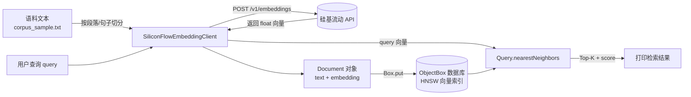

# Embedding + ObjectBox 向量检索 —— 设计文档 (待 Review)

> 目标：搭建一个最小可运行的 Demo，学习 **ObjectBox 向量的存取与检索**（HNSW 索引、`nearestNeighbors` 查询），
> 用硅基流动（SiliconFlow）在线 Embedding 模型作为向量来源，模拟 RAG 中"文本 → 向量 → 入库 → 相似检索"的核心链路。

---

## 1. 整体流程



两个阶段，和 `quickstart`/`vectorsearch-cities` 例子的写法一致（分阶段 + 交互式 CLI）：

1. **写入阶段**：读取语料 → 调用 Embedding API（可批量）→ 得到向量 → `box.put()` 写入 ObjectBox。
2. **检索阶段**：用户输入一段查询文本 → 调用 Embedding API 得到 query 向量 → `Query::nearestNeighbors()` 做 HNSW 近似最近邻检索 → 输出 Top-K 结果及相似度分数（`findWithScores()`）。

---

## 2. 硅基流动 Embedding API

OpenAI 兼容协议，接口示例（细节以你提供的 `base_url`/`api_key` 为准，届时会做适配）：

```
POST {base_url}/embeddings
Authorization: Bearer {api_key}
Content-Type: application/json

{
  "model": "BAAI/bge-m3",       // 待你确认具体模型名 & 向量维度
  "input": ["文本1", "文本2"]     // 支持单条 string 或 batch 数组
}
```

响应：

```json
{
  "model": "BAAI/bge-m3",
  "data": [
    { "object": "embedding", "index": 0, "embedding": [0.01, -0.02, ...] }
  ],
  "usage": { "prompt_tokens": 12, "total_tokens": 12 }
}
```

**已确认：**
- 模型使用 `BAAI/bge-m3`，输出向量维度 **1024**，写入 `.fbs` 的 `hnsw-dimensions=1024`。
- 配置方式：`base_url` / `api_key` / `model` 统一放在 `config.json` 中，程序启动时读取。

> ⚠️ 安全性：`config.json` 已加入 `.gitignore`，不会被提交到仓库；仓库中只保留 `config.example.json` 作为模板。日志中不会打印 `api_key`。

---

## 3. ObjectBox 数据模型

参照 `vectorsearch-cities` 例子的向量索引写法，定义 `Document` 实体：

```fbs
// document.fbs
table Document {
    id: ulong;
    text: string;              // 原始文本片段（RAG 中的 chunk）
    source: string;            // 来源文件名，便于溯源
    /// objectbox: index=hnsw, hnsw-dimensions=1024
    /// objectbox: hnsw-distance-type=Cosine
    embedding: [float];
}

root_type Document;
```

要点：
- `hnsw-dimensions` 必须等于所选 embedding 模型的输出维度（待确认后填入）。
- `hnsw-distance-type=Cosine`：文本语义检索通常用余弦相似度（`vectorsearch-cities` 用的是 `Geo`，我们这里换成 `Cosine`）。
- 通过 ObjectBox Generator 生成 `document.obx.h/.hpp/.cpp` 和 `objectbox-model.h`（和 `quickstart` 目录下 `task.obx.*` 的生成方式一致）。产物和 `.fbs` 一起收纳在 `obx/` 子目录中。

---

## 4. 项目目录结构（`examples/tutorials/embedding_test/`）

```
examples/tutorials/embedding_test/
├── doc/design.md              # 本设计文档
├── CMakeLists.txt             # 引入 objectbox + libcurl + nlohmann/json
├── main.cpp                   # 交互式 CLI：import / add / search / exit
├── embedding_test_app.hpp     # CLI 主循环 & 命令路由
├── siliconflow_client.hpp/.cpp # 封装 SiliconFlow Embedding HTTP 调用
├── config.hpp/.cpp            # emb_config.json 加载
├── emb_config.json            # 运行时配置（base_url / api_key / model）
└── obx/                       # ObjectBox schema 目录
    ├── document.fbs           # 手写：FlatBuffers Schema（含 HNSW 向量索引）
    ├── document.obx.hpp/.cpp  # Generator 生成（DO NOT EDIT）
    └── objectbox-model.h/json # Generator 生成（json 必须 commit，记录 ID/UID）
```

示例语料统一放在仓库根目录的 `data/corpus/corpus_sample.txt`，构建时会自动拷贝到本目录的构建产物中，方便 `examples/rag_apps/rag_basic` 等其他 demo 共用。

重新生成 obx 绑定代码（仅编辑 `document.fbs` 后需要）：

```bash
cd examples/tutorials/embedding_test
objectbox-generator -cpp obx/document.fbs
```

Generator 默认把产物写到 `.fbs` 所在目录，无需 `-out` 参数；
产物会覆盖 `obx/` 中除 `.fbs` 之外的 4 个文件。CMake 已把
`obx/` 加进源文件列表和 include 路径，业务代码直接
`#include "document.obx.hpp"` / `#include "objectbox-model.h"` 即可。

---

## 5. 核心模块设计

### 5.1 `SiliconFlowEmbeddingClient`

```cpp
class SiliconFlowEmbeddingClient {
public:
    SiliconFlowEmbeddingClient(std::string baseUrl, std::string apiKey, std::string model);

    // 单条文本 -> 向量
    std::vector<float> embed(const std::string& text);

    // 批量文本 -> 向量列表（一次 HTTP 请求，减少调用次数）
    std::vector<std::vector<float>> embedBatch(const std::vector<std::string>& texts);

private:
    std::string post(const std::string& jsonBody); // 底层 libcurl 封装
};
```

- HTTP：使用系统已安装的 **libcurl**（`libcurl4-openssl-dev`，已确认可用），封装同步 POST 请求，设置超时、TLS 校验（默认开启，不关闭证书校验）。
- JSON：引入 **nlohmann/json**（header-only，通过 CMake `FetchContent` 拉取，无需系统安装）。
- 错误处理：网络失败/超时抛异常；HTTP 状态码非 2xx 时解析错误信息并抛出；不打印 `api_key` 到日志。

### 5.2 `main.cpp`（交互式 CLI，风格参考 `VectorSearchCitiesApp`）

命令设计：

| 命令 | 说明 |
|------|------|
| `import <path>` | 读取文本文件，按空行/句号切分为 chunk，批量 embedding 后写入 |
| `add <text>` | 单条文本即时 embedding 并写入 |
| `search <query> [topK]` | 对 query 做 embedding，`nearestNeighbors` 检索，打印 Top-K + score |
| `ls` | 列出所有已存储的 Document（id/source/text 前缀） |
| `removeAll` | 清空数据 |
| `help` / `exit` | 帮助 / 退出 |

### 5.3 与 ObjectBox 的交互（关键 API，沿用 `vectorsearch-cities` 用法）

```cpp
obx::Box<Document> box(store);
obx::Query<Document> queryByVector =
    box.query(Document_::embedding.nearestNeighbors({}, 1)).build();

// 写入
Document doc;
doc.text = chunk;
doc.embedding = client.embed(chunk);
box.put(doc);

// 检索
queryByVector.setParameter(Document_::embedding, queryVector);
queryByVector.setParameterMaxNeighbors(Document_::embedding, topK);
auto results = queryByVector.findWithScores(); // vector<pair<Document, double>>
```

---

## 6. 如何运行

```bash
cd examples/tutorials/embedding_test
mkdir -p build && cd build
cmake .. && make
./embedding_test
> import sample.txt
> search 什么是向量数据库 3
```
