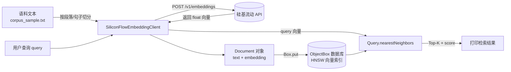

# Embedding + ObjectBox 向量检索 —— 设计文档 (待 Review)

> 目标：搭建一个最小可运行的 Demo，学习 **ObjectBox 向量的存取与检索**（HNSW 索引、`nearestNeighbors` 查询），
> 用硅基流动（SiliconFlow）在线 Embedding 模型作为向量来源，模拟 RAG 中"文本 → 向量 → 入库 → 相似检索"的核心链路。

---

## 1. 整体流程



两个阶段，和 `quickstart`/`vectorsearch-cities` 例子的写法一致（分阶段 + 交互式 CLI）：

1. **写入阶段**：读取语料 → 调用 Embedding API（可批量）→ 得到向量 → `box.put()` 写入 ObjectBox。
2. **检索阶段**：用户输入一段查询文本 → 调用 Embedding API 得到 query 向量 → `Query::nearestNeighbors()` 做 HNSW 近似最近邻检索 → 输出 Top-K 结果及相似度分数（`findWithScores()`）。

---

## 2. 硅基流动 Embedding API

OpenAI 兼容协议，接口示例（细节以你提供的 `base_url`/`api_key` 为准，届时会做适配）：

```
POST {base_url}/embeddings
Authorization: Bearer {api_key}
Content-Type: application/json

{
  "model": "BAAI/bge-m3",       // 待你确认具体模型名 & 向量维度
  "input": ["文本1", "文本2"]     // 支持单条 string 或 batch 数组
}
```

响应：

```json
{
  "model": "BAAI/bge-m3",
  "data": [
    { "object": "embedding", "index": 0, "embedding": [0.01, -0.02, ...] }
  ],
  "usage": { "prompt_tokens": 12, "total_tokens": 12 }
}
```

**已确认：**
- 模型使用 `BAAI/bge-m3`，输出向量维度 **1024**，写入 `.fbs` 的 `hnsw-dimensions=1024`。
- 配置方式：`base_url` / `api_key` / `model` 统一放在 `config.json` 中，程序启动时读取。

> ⚠️ 安全性：`config.json` 已加入 `.gitignore`，不会被提交到仓库；仓库中只保留 `config.example.json` 作为模板。日志中不会打印 `api_key`。

---

## 3. ObjectBox 数据模型

参照 `vectorsearch-cities` 例子的向量索引写法，定义 `Document` 实体：

```fbs
// document.fbs
table Document {
    id: ulong;
    text: string;              // 原始文本片段（RAG 中的 chunk）
    source: string;            // 来源文件名，便于溯源
    /// objectbox: index=hnsw, hnsw-dimensions=1024
    /// objectbox: hnsw-distance-type=Cosine
    embedding: [float];
}

root_type Document;
```

要点：
- `hnsw-dimensions` 必须等于所选 embedding 模型的输出维度（待确认后填入）。
- `hnsw-distance-type=Cosine`：文本语义检索通常用余弦相似度（`vectorsearch-cities` 用的是 `Geo`，我们这里换成 `Cosine`）。
- 通过 ObjectBox Generator 生成 `document.obx.h/.hpp/.cpp` 和 `objectbox-model.h`（和 `quickstart` 目录下 `task.obx.*` 的生成方式一致）。产物和 `.fbs` 一起收纳在 `obx/` 子目录中。

---

## 4. 项目目录结构（`examples/tutorials/embedding_test/`）

```
examples/tutorials/embedding_test/
├── doc/design.md              # 本设计文档
├── CMakeLists.txt             # 引入 objectbox + libcurl + nlohmann/json
├── main.cpp                   # 交互式 CLI：import / add / search / exit
├── embedding_test_app.hpp     # CLI 主循环 & 命令路由
├── siliconflow_client.hpp/.cpp # 封装 SiliconFlow Embedding HTTP 调用
├── config.hpp/.cpp            # emb_config.json 加载
├── emb_config.json            # 运行时配置（base_url / api_key / model）
└── obx/                       # ObjectBox schema 目录
    ├── document.fbs           # 手写：FlatBuffers Schema（含 HNSW 向量索引）
    ├── document.obx.hpp/.cpp  # Generator 生成（DO NOT EDIT）
    └── objectbox-model.h/json # Generator 生成（json 必须 commit，记录 ID/UID）
```

示例语料统一放在仓库根目录的 `data/corpus/corpus_sample.txt`，构建时会自动拷贝到本目录的构建产物中，方便 `examples/rag_apps/rag_basic` 等其他 demo 共用。

重新生成 obx 绑定代码（仅编辑 `document.fbs` 后需要）：

```bash
cd examples/tutorials/embedding_test
objectbox-generator -cpp obx/document.fbs
```

Generator 默认把产物写到 `.fbs` 所在目录，无需 `-out` 参数；
产物会覆盖 `obx/` 中除 `.fbs` 之外的 4 个文件。CMake 已把
`obx/` 加进源文件列表和 include 路径，业务代码直接
`#include "document.obx.hpp"` / `#include "objectbox-model.h"` 即可。

---

## 5. 核心模块设计

### 5.1 `SiliconFlowEmbeddingClient`

```cpp
class SiliconFlowEmbeddingClient {
public:
    SiliconFlowEmbeddingClient(std::string baseUrl, std::string apiKey, std::string model);

    // 单条文本 -> 向量
    std::vector<float> embed(const std::string& text);

    // 批量文本 -> 向量列表（一次 HTTP 请求，减少调用次数）
    std::vector<std::vector<float>> embedBatch(const std::vector<std::string>& texts);

private:
    std::string post(const std::string& jsonBody); // 底层 libcurl 封装
};
```

- HTTP：使用系统已安装的 **libcurl**（`libcurl4-openssl-dev`，已确认可用），封装同步 POST 请求，设置超时、TLS 校验（默认开启，不关闭证书校验）。
- JSON：引入 **nlohmann/json**（header-only，通过 CMake `FetchContent` 拉取，无需系统安装）。
- 错误处理：网络失败/超时抛异常；HTTP 状态码非 2xx 时解析错误信息并抛出；不打印 `api_key` 到日志。

### 5.2 `main.cpp`（交互式 CLI，风格参考 `VectorSearchCitiesApp`）

命令设计：

| 命令 | 说明 |
|------|------|
| `import <path>` | 读取文本文件，按空行/句号切分为 chunk，批量 embedding 后写入 |
| `add <text>` | 单条文本即时 embedding 并写入 |
| `search <query> [topK]` | 对 query 做 embedding，`nearestNeighbors` 检索，打印 Top-K + score |
| `ls` | 列出所有已存储的 Document（id/source/text 前缀） |
| `removeAll` | 清空数据 |
| `help` / `exit` | 帮助 / 退出 |

### 5.3 与 ObjectBox 的交互（关键 API，沿用 `vectorsearch-cities` 用法）

```cpp
obx::Box<Document> box(store);
obx::Query<Document> queryByVector =
    box.query(Document_::embedding.nearestNeighbors({}, 1)).build();

// 写入
Document doc;
doc.text = chunk;
doc.embedding = client.embed(chunk);
box.put(doc);

// 检索
queryByVector.setParameter(Document_::embedding, queryVector);
queryByVector.setParameterMaxNeighbors(Document_::embedding, topK);
auto results = queryByVector.findWithScores(); // vector<pair<Document, double>>
```

---

# 6. ObjectBox 使用详解

本章从 **Schema 定义 → 数据库创建 → 写入(存) → 检索(取)** 四个阶段，结合本项目代码详细说明 ObjectBox 的使用细节。

### 6.1 Schema 定义与代码生成

ObjectBox 使用 FlatBuffers schema（`.fbs`）描述实体，见 `obx/document.fbs`：

```fbs
table Document {
    id: ulong;
    text: string;      // 原始文本片段 (RAG chunk)
    source: string;    // 来源文件名，便于溯源

    /// objectbox: index=hnsw, hnsw-dimensions=1024
    /// objectbox: hnsw-distance-type=Cosine
    embedding: [float];
}

root_type Document;
```

关键点：

- `id: ulong` — ObjectBox 要求每个实体有一个 `ulong` 主键，作为内部自增 ID。
- `embedding: [float]` — 浮点向量字段，通过注释注解 `objectbox: index=hnsw` 声明建立 **HNSW 向量索引**，维度 1024，距离度量为余弦相似度。

#### `.fbs` HNSW 注解参考

向量字段的索引行为通过 `/// objectbox:` 注释注解配置，可用注解及取值如下（源自 `objectbox.h` 中 `obx_model_property_index_hnsw_*` 系列 API）：

| 注解 | 取值 | 默认值 | 说明 |
|------|------|--------|------|
| `index=hnsw` | 固定值 | 无 | 启用 HNSW 向量索引（必须） |
| `hnsw-dimensions=<N>` | 正整数 | 无（必须指定） | 向量维度；高于此值的维度被截断，低于此值的向量不被索引 |
| `hnsw-distance-type=<T>` | 见下表 | `Euclidean` | 距离度量算法 |
| `hnsw-neighbors-per-node=<N>` | 正整数（如 16/30/64） | 30 | 每节点最大连接数（M）；越大精度越高、内存越大 |
| `hnsw-indexing-search-count=<N>` | 正整数（如 100/200） | 100 | 建索引时搜索广度（efConstruction）；越大索引质量越好但越慢 |
| `hnsw-flags=<F>` | 见下表，可位或组合 | 0 | 行为标志位 |
| `hnsw-reparation-backlink-probability=<f>` | 0.0 \~ 1.0 | 1.0 | 删除节点后修复图时添加反向连接的概率 |
| `hnsw-vector-cache-hint-size-kb=<N>` | 正整数 | 2097152 (2GB) | 向量缓存大小提示（非强制） |

**`hnsw-distance-type` 取值（`OBXVectorDistanceType` 枚举）：**

| 取值 | 值域 | 适用场景 |
|------|------|----------|
| `Euclidean` | 0 \~ ∞ | 默认；内部使用欧氏距离平方，适合通用场景 |
| `Cosine` | 0.0 \~ 2.0 | 文本/语义相似度（忽略向量模长，只比较方向）；0=同向, 1=正交, 2=反向 |
| `DotProduct` | 0.0 \~ 2.0 | 已归一化向量（长度=1）时等价于 Cosine，性能更好 |
| `DotProductNonNormalized` | 0.0 \~ 2.0（非线性） | 未归一化向量的点积相似度；不替代 Cosine |
| `Geo` | — | 地理坐标（纬度/经度），维度必须为 2，内部用 haversine 距离 |

> 注：`Manhattan`(4) 和 `Hamming`(5) 在头文件中已预留但尚未启用。

**`hnsw-flags` 取值（`OBXHnswFlags` 位标志，可用 `|` 组合）：**

| 标志 | 值 | 说明 |
|------|---|------|
| `None` | 0 | 无特殊标志 |
| `DebugLogs` | 1 | 启用调试日志 |
| `DebugLogsDetailed` | 2 | 启用高频调试日志（如每次 get/put） |
| `VectorCacheSimdPaddingOff` | 4 | 关闭 SIMD 填充（省内存，可能稍慢） |
| `ReparationLimitCandidates` | 8 | 加速节点删除后的图修复（牺牲少量图质量） |

本项目使用的注解组合：

```fbs
/// objectbox: index=hnsw, hnsw-dimensions=1024
/// objectbox: hnsw-distance-type=Cosine
```

即：1024 维 + 余弦距离，其余参数取默认值（M=30, efConstruction=100）。

运行 ObjectBox Generator 后，在 `obx/` 目录产出：

| 文件 | 作用 |
|------|------|
| `objectbox-model.h` | `create_obx_model()` 函数，用 C API 注册实体/属性/索引元信息 |
| `document.obx.hpp` | C++ 结构体 `Document` + 属性描述符 `Document_` |
| `document.obx.cpp` | FlatBuffer 序列化/反序列化实现 |
| `objectbox-model.json` | 模型 ID/UID 记录，**必须提交到版本控制** |

### 6.2 数据库创建（Store 初始化）

见 `main.cpp`：

```cpp
obx::Options options(create_obx_model());   // ① 用生成的模型元信息构建 Options
options.directory("objectbox-db");           // ② 指定数据库文件存放目录
obx::Store store(options);                   // ③ 打开/创建数据库
```

细节：

1. **`create_obx_model()`**（`objectbox-model.h`）— 依次调用 `obx_model_entity()`、`obx_model_property()`、`obx_model_property_index_hnsw_dimensions()` 等 C API，将 schema 中定义的实体、属性、HNSW 索引参数注册到 `OBX_model` 对象。
2. **`obx::Options`** — 持有 model 指针，可配置数据库目录、最大 DB 大小等。
3. **`obx::Store`** — 构造时调用底层 `obx_store_open()`；目录不存在则自动创建数据库文件，已存在则打开已有数据库。model 指针在此时被消费，无需手动释放。

打开后通过 `obx::Box<Document>` 获得对 `Document` 实体的操作句柄：

```cpp
obx::Box<Document> box(store);  // 绑定到 store 上的 Document 表
```

### 6.3 数据写入（存）

#### 单条写入

见 `embedding_test_app.hpp` 中的 `addDocument()`：

```cpp
void addDocument(const std::string& text, const std::string& source) {
    Document doc;
    doc.id = 0;                        // id=0 表示让 ObjectBox 自动分配 ID
    doc.text = text;
    doc.source = source;
    doc.embedding = client.embed(text); // 调用 Embedding API 获取 1024 维向量
    obx_id id = box.put(doc);          // 写入数据库，返回实际分配的 ID
}
```

- **`box.put(doc)`**：内部调用 `Document::_OBX_MetaInfo::toFlatBuffer()` 将对象序列化为 FlatBuffer 二进制后写入存储引擎。
- 若 `doc.id == 0`，ObjectBox 自动分配递增 ID；若 `doc.id` 非零且已存在，则为**更新**操作。

#### 批量写入（显式事务）

见 `importFile()`：

```cpp
obx::Transaction tx = store.tx(obx::TxMode::WRITE);  // 开启写事务
for (size_t i = 0; i < chunks.size(); i++) {
    Document doc;
    doc.id = 0;
    doc.text = chunks[i];
    doc.source = path;
    doc.embedding = vectors[i];
    box.put(doc);
}
tx.success();  // 提交事务（若不调用则回滚）
```

- 显式事务将多次 `put` 合并为一次磁盘写入，性能远优于逐条自动提交。
- `tx.success()` 相当于 commit；中途抛异常时 `Transaction` 析构自动 rollback。

#### 序列化细节

`document.obx.cpp` 中的 `toFlatBuffer`：

```cpp
fbb.CreateString(object.text);        // 字符串 → FlatBuffer offset
fbb.CreateVector(object.embedding);   // float[] → FlatBuffer vector offset
fbb.StartTable();
fbb.AddElement(4, object.id);         // slot 4 = id
fbb.AddOffset(6, offsettext);         // slot 6 = text
fbb.AddOffset(8, offsetsource);       // slot 8 = source
fbb.AddOffset(10, offsetembedding);   // slot 10 = embedding
fbb.EndTable(); fbb.Finish();
```

ObjectBox 底层用 FlatBuffer 做零拷贝序列化，读取时可直接从内存映射文件中解析，无额外反序列化开销。

### 6.4 数据检索（取）

#### 6.4.1 HNSW 检索原理

ObjectBox 的向量检索**并非**将 query 向量与库中每条记录逐一比对（暴力搜索），而是基于 **HNSW（Hierarchical Navigable Small World）** 算法实现**近似最近邻（ANN）** 搜索。

```
Layer 2 (最稀疏):    A ─────────────── D
                     │                 │
Layer 1 (中等):      A ─── B ─── C ─── D
                     │     │     │     │
Layer 0 (最密集):    A ─ B ─ E ─ C ─ F ─ D ─ G
```

**建图阶段（写入时）**：每次 `box.put(doc)` 插入新向量时，ObjectBox 在 HNSW 图中为该节点建立与近邻的双向连接，每个节点最多连接 M 个邻居（默认 M=30）。

**搜索阶段（查询时）**：

1. 从最高层的入口节点出发；
2. 在当前层贪心地跳到离 query 更近的邻居；
3. 到达局部最优后，下降到下一层继续搜索；
4. 在最底层（Layer 0）维护一个大小为 `ef` 的候选集做精细搜索；
5. 最终从候选集中返回 topK 个最近的。

搜索只需访问 **O(log N)** 量级的节点，而非全部 N 个。百万级向量下，实际可能只比对几百个节点就能返回高质量结果。

| | 暴力搜索 (Brute-force) | HNSW (ObjectBox 采用) |
|--|--|--|
| 比对次数 | N（全量） | O(log N)（图导航） |
| 结果 | 精确 Top-K | 近似 Top-K（极大概率命中真实近邻） |
| 适用规模 | < 几万条 | 百万～亿级 |
| 额外开销 | 无 | 需维护图结构（内存 + 写入时建图） |

#### 6.4.2 HNSW 关键参数

可在 `.fbs` 注解或 C API（`obx_model_property_index_hnsw_*`）中配置：

| 参数 | 默认值 | 作用 |
|------|--------|------|
| `hnsw-dimensions` | 必须指定 | 向量维度（本项目 1024） |
| `hnsw-distance-type` | Euclidean | 距离度量；本项目使用 `Cosine`（值域 0.0\~2.0，0 表示同向） |
| `neighbors_per_node`（M） | 30 | 每个节点最大连接数；越大图越稠密、精度越高、内存越大 |
| `indexing_search_count`（efConstruction） | 100 | 建索引时的搜索广度；越大索引质量越好但建索引越慢 |
| `max_result_count`（查询时的 ef） | 即 topK | 搜索候选集大小；可设得比实际 limit 大来提高精度 |

> **精度 vs 性能 tradeoff**：`max_result_count=100` 配合 `query.limit(10)`，可以得到比直接 `max_result_count=10` 更高质量的 10 条结果——用少量额外计算换取更好的召回率。

#### 6.4.3 基本操作

```cpp
// 全量读取
std::vector<std::unique_ptr<Document>> all = box.getAll();

// 清空所有记录
uint64_t removed = box.removeAll();
```

#### 6.4.4 向量近邻检索

**构建 Query**（构造函数中完成，只构建一次，后续复用）：

```cpp
queryByVector_(box.query(Document_::embedding.nearestNeighbors({}, 1)).build())
```

- `nearestNeighbors({}, 1)` — 声明对 `embedding` 字段做 KNN 查询，初始占位 1 个邻居。
- `.build()` — 编译为可复用的 `obx::Query<Document>` 对象。

**执行检索**（见 `search()`）：

```cpp
void search(const std::string& queryText, int64_t topK) {
    // ① 把查询文本转为向量
    std::vector<float> queryVector = client.embed(queryText);

    // ② 设置查询参数（复用预构建的 Query 对象）
    queryByVector_.setParameter(Document_::embedding, queryVector);
    queryByVector_.setParameterMaxNeighbors(Document_::embedding, topK);

    // ③ 执行 HNSW 近邻搜索，返回 (Document, score) 对
    std::vector<std::pair<Document, double>> results = queryByVector_.findWithScores();
}
```

- 每次搜索前通过 `setParameter` 传入实际查询向量，`setParameterMaxNeighbors` 动态调整 topK。
- `findWithScores()` 返回结果及余弦距离分数（score 越小越相似；Cosine distance = 1 − cosine_similarity）。

#### 6.4.5 Query 检索方法一览

构建好的 `obx::Query<Document>` 对象支持以下方法：

**查找类（返回完整对象）：**

| 方法 | 返回值 | 说明 |
|------|--------|------|
| `find()` | `vector<Document>` | 所有匹配对象（值拷贝） |
| `findUniquePtrs()` | `vector<unique_ptr<Document>>` | 同上，智能指针避免拷贝 |
| `findWithScores()` | `vector<pair<Document, double>>` | 对象 + 距离分数，**按 score 升序** |
| `findFirst()` | `unique_ptr<Document>` | 只取第一条，无匹配返回 nullptr |
| `findUnique()` | `unique_ptr<Document>` | 期望恰好一条，多条则抛异常 |
| `findFirstOptional()` | `optional<Document>` | C++17 optional 版 findFirst |
| `findUniqueOptional()` | `optional<Document>` | C++17 optional 版 findUnique |

**仅取 ID 类（更轻量，不反序列化对象）：**

| 方法 | 返回值 | 说明 |
|------|--------|------|
| `findIds()` | `vector<obx_id>` | 只返回匹配对象的 ID |
| `findIdsWithScores()` | `vector<pair<obx_id, double>>` | ID + 分数，按 score 升序 |
| `findIdsByScore()` | `vector<obx_id>` | ID 按 score 升序，不带分数 |

**遍历 / 聚合 / 删除：**

| 方法 | 说明 |
|------|------|
| `visit(callback, userData)` | 逐条回调访问匹配对象（C 风格 visitor） |
| `visitWithScore(callback, userData)` | 同上，回调额外带 score，按 score 排序 |
| `count()` | 返回匹配数量，不取出对象 |
| `remove()` | 删除所有匹配对象，返回删除数量 |

**分页与参数控制：**

| 方法 | 说明 |
|------|------|
| `offset(n)` | 跳过前 n 条结果 |
| `limit(n)` | 最多返回 n 条 |
| `setParameter(Document_::embedding, queryVec)` | 设置查询向量 |
| `setParameterMaxNeighbors(Document_::embedding, topK)` | 设置最大返回邻居数（即 HNSW 的 ef） |

### 6.5 设计要点小结

| 要点 | 说明 |
|------|------|
| HNSW 索引 | 在 `.fbs` 注解中声明，ObjectBox 自动维护，写入时增量构建图结构 |
| ANN 近似搜索 | O(log N) 复杂度，非暴力遍历；通过 ef/M 参数调节精度与性能 |
| FlatBuffer 序列化 | 零拷贝读取，无需额外反序列化 |
| Query 对象复用 | 避免每次搜索重建查询计划，只需更新参数 |
| 写事务 | 批量导入合并为单次 fsync，大幅提升吞吐 |

---

## 7. 如何运行

```bash
cd examples/tutorials/embedding_test
mkdir -p build && cd build
cmake .. && make
./embedding_test
> import sample.txt
> search 什么是向量数据库 3
```
